= Java Cloud Development Bootstrap
Francesco De Domenico
:toc: left
:source-highlighter: rouge
:icons: font
:doctype: book
:stem:

== Introduzione

== Risorse

* https://www.baeldung.com/[*Baeldung blog*]: blog con molti tutorials ed esempi sulle librerie ed il framework Spring e Springboot
* https://amzn.to/3UqWkYG[*[ENG\] Pro Spring Boot 2: An Authoritative Guide to Building Microservices, Web and Enterprise Applications, and Best Practices*] - Felipe Gutierrez
* https://amzn.to/3dktGHK[*[ENG\] Pro Spring 5: An In-Depth Guide to the Spring Framework and Its Tools*] - Iuliana Cosmina, Rob Harrop, Chris Schaefer, Clarence Ho 
* https://amzn.to/3dkGgqs[*[ITA\] Concetti di informatica e fondamenti di Java*] -  Cay S. Horstmann

== Prerequisiti

. Fondamenti di Java e programmazione ad oggetti
.. Java 8+
.. Strutture dati: List, Set, Map,
.. Java Generics
.. Bean Injection
.. Stream API => lambda functions
.. Exception handling
.. Java Annotations "@"
.. equals and hashcode: differenze ed usi
.. Project Management tools: Maven & Gradle
.. Data and SW Modeling: UML & ER diagrams
. Network, HTTP & Web
.. Fondamenti:
... com'è fatta una richiesta HTTP?
... Verbo, Headers, Corpo della richiesta, corpo della risposta
... mime-type, Content-Types
... Web markup/notations: HTML, XML, JSON, YAML
... CORS
.. Web Standards
... JWT
... OAuth2: REST + Bearer Token
.. RESTful APIs
.. Che cos'è un webserver?
. DB Transazionali
.. MySQL/MariaDB
.. Creazione tabelle
.. Queries con joins
.. Transazioni
.. Foreign keys
.. Script di inizializzazione tabelle e popolamento database

== Obiettivi
. Source distributed version control systems
.. Git: di cosa si tratta?
... Concetti base: branches, commit, merge, risoluzione dei conflitti, stashing
.. CI/CD: di cosa si tratta?
. Spring + Spring Boot
.. Cos'è un framework? 
.. Cos'è il paradigma MVC?
.. Spring Bean Initialization & @SpringApplication
.. @Component, @Client, @Service, @Controller, @Configuration, @Value
.. Spring @Entity
.. @OneToOne, @OneToMany, @ManyToOne, @ManyToMany
.. Hibernate
.. Spring Repositories
.. JPA Queries
.. Object serialization/deserialization through Jackson
.. Lombok Annotations
.. CrossOrigin
. Docker
.. Docker images, orchestrazione ed interfacciamento con OS host (es: Ports Expose)
.. Dockerfile: struttura e sintassi
... Creazione Dockerfile per applicativo Springboot
.. Docker Compose: struttura e sintassi
... Composizione servizi, volumes, volumes mount
... Comandi compose per esecuzione
. Kubernetes
.. Relazione tra Kubernetes e Docker
.. Worker, node e pods
.. Secrets ed Environment Variables di un deployment Kubernetes

== Corso: Video tutorials

=== git

video::N_bMCff8q6A[youtube, width=800, height=450]

=== Spring Boot

video::vtPkZShrvXQ[youtube, width=800, height=450]

=== Docker

video::3c-iBn73dDE[youtube, width=800, height=450]

=== Kubernetes

video::d6WC5n9G_sM[youtube, width=800, height=450]

== Prima di iniziare

Al fine di installare il software necessario, su Windows, si suggerisce l'installazione del package manager *chocolatey*.

Aprire terminale Powershell ed eseguire:

[source]
--
Set-ExecutionPolicy Bypass -Scope Process -Force; [System.Net.ServicePointManager]::SecurityProtocol = [System.Net.ServicePointManager]::SecurityProtocol -bor 3072; iex ((New-Object System.Net.WebClient).DownloadString('https://community.chocolatey.org/install.ps1'))
--

Una volta installato il package manager potrà essere utilizzato per installare il software propedeutico allo sviluppo:

[source, powershell]
----
choco install vscode temurin17 maven gradle curl git postman chocolateygui
----

Consigliamo inoltre di avere, su sistemi Windows, degli ambienti shell aggiornati:

[source, powershell]
----
choco install powershell-core microsoft-windows-terminal 
----

per chi utilizzasse shell *nix non ci sono problemi di compatibilità con gli esempi riportati in questa guida, gli utenti windows possono usufruire di un environment linux attraverso la piattaforma Windows Subsystem for Linux. Potete consultare la guida per attivarlo al seguente https://learn.microsoft.com/it-it/training/modules/get-started-with-windows-subsystem-for-linux/[link].

Una volta installato Visual Studio Code installare le seguenti estensioni:

* https://marketplace.visualstudio.com/items?itemName=redhat.java[Language support for Java ™ for Visual Studio Code]
* https://marketplace.visualstudio.com/items?itemName=Pivotal.vscode-boot-dev-pack[Spring Boot Extension Pack]

== Capitolo 1: Getting Started with Spring
=== 1.1 Introduzione

*Spring* nasce come https://it.wikipedia.org/wiki/Framework[framework] per lo sviluppo di applicazioni Server. Al suo interno comprende una collezione di pacchetti nata per facilitare il lavoro degli sviluppatori definendo un pattern preciso di utilizzo.
Utilizzando i paradigmi forniti dal framework è possibile scrivere, grazie all'uso di https://www.baeldung.com/java-decorator-pattern[decoratori], classi concise nel numero di righe di codice ma ricche di funzionalità, ad esempio:

* Creare classi di configurazioni automaticamente popolate con il contenuto di file properties
* Effettuare queries su database scrivendo solo la firma di un metodo
* Creare un'API REST tramite l'uso di un unico decoratore agganciato ad un metodo Java
* ... e molto altro!

*Spring Boot* è un progetto relativamente più recente, nasce con l'esigenza di avere una soluzione facilmente deployabile, self-contained, di server che erogano un determinato servizio. Questo tipo di approccio si è rivelato particolarmente vincente con il nascere di architetture di calcolatori distribuite e containerizzate in quanto Spring Boot fornisce un eseguibile Java contenente tutti i pacchetti e le librerie, compreso un https://en.wikipedia.org/wiki/Web_server[webserver] embedded, da eseguire.

NOTE: Un archivio *jar* che contenga tutto il necessario senza bisogno di librerie esterne è detto *fatjar*. Quando si dispone di tale pacchetto è possibile creare un leggerissimo container per l'esecuzione del servizio contenente soltanto una distro Linux minimale ed una JRE per l'esecuzione dello stesso!

Il framework Spring è costituito da un ecosistema esteso di pacchetti e librerie (spesso frameworks a loro volta). Al fine di gestire tale complesso insieme di software è necessario gestire un progetto Spring tramite un software di distribution management, al momento sono supportati:

* https://maven.apache.org/[Maven]
* https://gradle.org/[Gradle]

Questo tipo di strumenti ci consentono di risolvere le dipendenze esterne del nostro specifico progetto e garantirne la portabilità. Senza questo tipo di strumenti sarebbe di gran lunga più complesso fornire il nostro software a terzi in quanto costoro dovrebbero avere, nel loro CLASSPATH locale, tutte le librerie necessarie ed importate dal software che abbiamo scritto.

Con una soluzione di questo tipo invece dovremo condividere, oltre al codice sorgente della nostra applicazione, solo uno specifico file chiamato *file di distribuzione*:

* *pom.xml* per Maven
* *build.gradle* per Gradle

Spring offre un tool web per la generazione iniziale di un progetto Spring boot chiamato https://start.spring.io/[Spring initializr] attraverso il quale è possibile scegliere i parametri iniziali attraverso cui generare il nostro progetto.

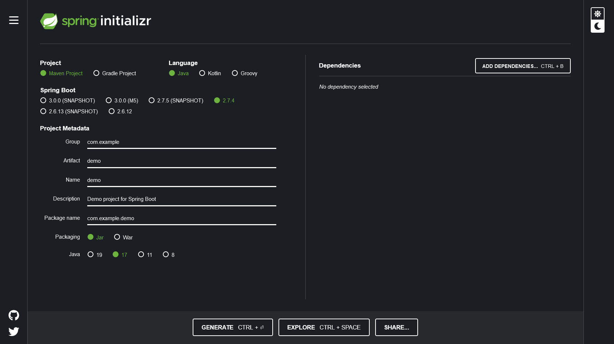

Di particolare importanza sono i parametri:

* Group: che determina il package principale della nostra applicazione Spring
* Artifact: il nome della nostra applicazione(come Java format)
* Name: Il nome della nostra applicazione(come Display name)
* Description: Una descrizione della nostra applicazione
* Package name: tipicamente viene composto automaticamente componendo Group+Artifact - ma è possibile effettuarne l'override
* Il packaging: il tipo di file di output che ci aspettiamo. Tipicamente le applicazioni full embedded, come quelle spring, vengono pacchettizzate sotto forma di jar comprendente tutte le librerie propedeutiche all'esecuzione del nostro software
* Java: la versione target di Java
* Dipendenze: Spring initializr offre un elenco di dipendenze popolari propedeutiche alla generazione di codice automatica, predisposizione controller per API REST, Unit Testing automatico, ecc...

TIP: è possibile aggiungere dipendenze anche dopo la generazione del progetto su spring initializr, semplicemente includendolo nel file di distribuzione come dipendenza

[NOTE] 
.Dove posso trovare altre dipendenze per il mio software?
==== 
Esistono vari motori di ricerca dedicati a questo scopo, uno dei più popolari, vero e proprio punto di riferimento è https://mvnrepository.com/[MVN Repository].

Non solo è possibile generare i tag necessari all'inclusione dei pacchetti nel nostro file di distribuzione, ma vengono anche indicate le vulnerabilità (CVE) delle versioni specifiche di ogni dipendenza.
====

=== 1.2 Il mio primo progetto Spring

Una volta generato il progetto su spring initializr avremo una struttura sul file system fatta in questo modo:

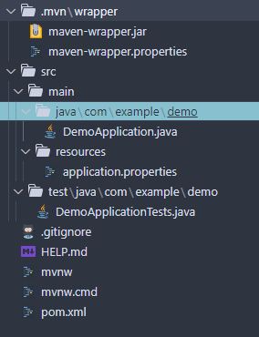

I file rilevanti per l'utilizzo sono: 

* DemoApplication.java: file principale dell'applicazione, entry point di Spring Boot
* application.properties: file di configurazione in formato properties java
* DemoApplicationTest.java: file di esempio contenente UnitTests
* pom.xml: file di distribuzione Maven

==== DemoApplication.java

Analizziamo il contenuto di *DemoApplication.java*
[source, java]
----
package com.example.demo;

import org.springframework.boot.SpringApplication;
import org.springframework.boot.autoconfigure.SpringBootApplication;

@SpringBootApplication
public class DemoApplication {

	public static void main(String[] args) {
		SpringApplication.run(DemoApplication.class, args);
	}

}
----
Possiamo innanzitutto notare che il package generato è il medesimo scelto inizialmente su spring initializr Group+Name. Successivamente notiamo il decoratore *@SpringBootApplication*

Questo è un decoratore fondamentale per Spring Boot, in quanto dichiara al framework di inizializzare l'applicazione a partire da questa classe e di inizializzare tutti gli https://www.baeldung.com/spring-bean[*Spring Beans*] a partire dal medesimo package della SpringBootApplication stessa.

Di fatti è buona prassi iniziare a creare sotto packages a partire da *package com.example.demo* in modo da garantirne la loro inizialzzazione. Immaginiamo di voler creare un nuovo client HTTP per accedere al servizio XZY, sarebbe bene collocarlo in un package dedicato all'interno del quale creare una classe per lo stesso client quindi:

1. Creeremo il subpackage com.example.demo.xyz.client
2. Al suo interno creeremo una classe chiamata XyzClient.java

IMPORTANT: la naming convention è molto importante per garantire la leggibilità del nostro codice, tipicamente in Java si utilizza la notazione https://en.wikipedia.org/wiki/Camel_case[camelCase] per metodi e variabili. Le classi seguono la medesima convenzione ma iniziano per lettera maiuscola.

==== application.properties

Si tratta di un file di testo contenente le cosiddette *properties* dell'applicazione. Si tratta di valori che non sono hardcoded nell'applicazione ma possono essere modificati *senza ricompilare il progetto*.

Per questa ragione è comodo avere su questo files parametri di configurazioni che possono essere soggetti a modifica nel corso di vita del software che stiamo progettando, ecco alcuni esempi:

* La porta di ascolto di un webserver
* Il path per effettuare una chiamata ad un servizio rest
* La dimensione massima accettata per una determinata richiesta
* Le label di testo presenti su un template HTML
* e molto altro!

==== DemoApplicationTest.java

[source, java]
----
package com.example.demo;

import org.junit.jupiter.api.Test;
import org.springframework.boot.test.context.SpringBootTest;

@SpringBootTest
class DemoApplicationTests {

	@Test
	void contextLoads() {
	}

}
----

In questo esempio la classe di test è scarna, tuttavia contiene un unico metodo utile che verifica se il *contesto*, ossia l'insieme dei beans e delle classi appartenenti all'applicazione, è stato correttamente inizializzato.

==== pom.xml

il file di distribuzione maven, riportiamo per brevità le parti più importanti:
[source, xml]
----
<?xml version="1.0" encoding="UTF-8"?>
<project xmlns="http://maven.apache.org/POM/4.0.0" xmlns:xsi="http://www.w3.org/2001/XMLSchema-instance"
	xsi:schemaLocation="http://maven.apache.org/POM/4.0.0 https://maven.apache.org/xsd/maven-4.0.0.xsd">
	<modelVersion>4.0.0</modelVersion>
	<parent>
		<groupId>org.springframework.boot</groupId>
		<artifactId>spring-boot-starter-parent</artifactId>
		<version>2.7.4</version>
		<relativePath/> <!-- lookup parent from repository -->
	</parent>
	<groupId>com.example</groupId>
	<artifactId>demo</artifactId>
	<version>0.0.1-SNAPSHOT</version>
	<name>demo</name>
	<description>Demo project for Spring Boot</description>
	<properties>
		<java.version>17</java.version>
	</properties>
	<dependencies>
		<dependency>
			<groupId>org.springframework.boot</groupId>
			<artifactId>spring-boot-starter</artifactId>
		</dependency>

		<dependency>
			<groupId>org.springframework.boot</groupId>
			<artifactId>spring-boot-starter-test</artifactId>
			<scope>test</scope>
		</dependency>
	</dependencies>

	<build>
		<plugins>
			<plugin>
				<groupId>org.springframework.boot</groupId>
				<artifactId>spring-boot-maven-plugin</artifactId>
			</plugin>
		</plugins>
	</build>

</project>

----

=== 1.3 Il mio primo @Controller

Il decoratore *@Controller* (ed anche le sue specializzazioni, come @RestController) è di vitale importanza in un progetto Spring Boot.

Questo tipo di notazione viene utilizzata dal framework Spring per individuare le classi contenenti gli handler che devono essere __bindati__ al webserver embedded (Tomcat è il webserver default).

Inizializziamo un nuovo progetto Spring da https://start.spring.io/[spring initializr] aggiungendo come dipendenza Spring Web

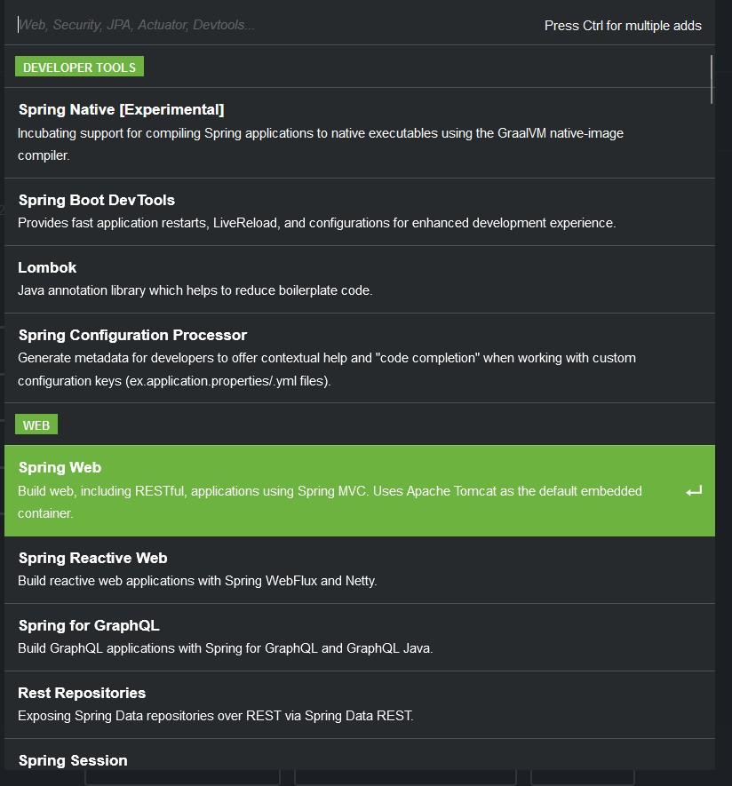

dopodichè generiamo il progetto iniziale.

Noteremo la solita struttura di progetto ma questa volta il file *pom.xml* avrà una nuova dipendenza

[source, xml]
----
<dependency>
	<groupId>org.springframework.boot</groupId>
	<artifactId>spring-boot-starter-web</artifactId>
</dependency>
----

Aggiungere una dipendenza informa la piattaforma di tooling e runtime che sono disponibili nuovi oggetti Java nel nostro CLASS_PATH, quindi saremo in grado di importare tutta una serie di strumenti che ci aiutino nello sviluppo.

Dobbiamo creare una classe che contenga un @Controller, per prima cosa creiamo un subpackage a partire dal nostro package di default (in questo caso abbiamo lasciato il default di spring initializr com.example.demo).

L'idea è quella di definire una struttura gerarchica che contenga le classi del nostro progetto, in prima istanza, non volendo fare distinzioni di https://it.wikipedia.org/wiki/Dominio_(informatica)[Dominio di business] creeremo un subpackage *controller* che conterrà tutti i controller della nostra applicazione.

Creiamo un primo controller che restituisca all'utente un messaggio di *Hello World!*.

All'interno del package com.example.demo.controller creiamo la classe *HelloWorldController.java*. Il nome della classe è importante, anche se non ha un vero e proprio significato funzionale incoraggiamo l'utilizzo non solo del CamelCase, ma anche di battezzare le classi nel formato {NomeDominio}{NomeComponente}.java - in questo modo siamo già in grado di comprendere la natura ed il ruolo di una classe semplicemente leggendone il nome!

All'interno di una classe decorata con @Controller possiamo definire un insieme di metodi, detti handler, che gestiranno una chiamata http del webserver con i parametri che abbiamo utilizzato per decorare l'handler.

Il nostro desiderio è creare una API che risponda sul path */hello* con verbo *HTTP GET* restituendo la stringa "Hello World!".

[source, java]
----
package com.example.demo.controller;

import org.springframework.stereotype.Controller;
import org.springframework.web.bind.annotation.RequestMapping;
import org.springframework.web.bind.annotation.RequestMethod;
import org.springframework.web.bind.annotation.ResponseBody;

@Controller
public class HelloWorldController {
    
    @RequestMapping(value = "/hello", method = RequestMethod.GET)
    @ResponseBody
    public String helloWorld(){
        return "Hello World!";
    }
}

----

La classe è di facile lettura. La notazione @Controller avvisa il framework che questo file contiene informazioni sugli handlers da bindare sul webserver, tuttavia dobbiamo informare il framework sul *path* e sul *verbo HTTP* necessari per invocare l'handler. In questo caso abbiamo utilizzato il decoratore *@RequestMapping* che al suo interno contiene i parametri *value* e *method* che contengono le informazioni necessarie per esporre la nostra API sul webserver embdedded. In ultimo, informiamo il framework che dovrà essere fornito un response body http di tipo *String*

Dalla root del nostro progetto proviamo a farlo partire con il comando:

[source, shell]
----
> mvn spring-boot:run
----

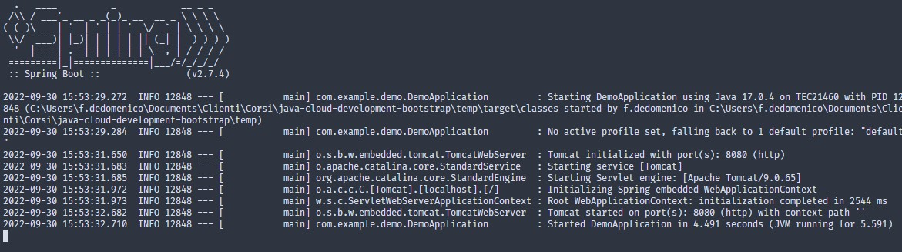

Non appena leggeremo _Started DemoApplication_ vorrà dire che il webserver è in ascolto sulla nostra macchina sulla porta 8080 (porta di default).

possiamo a questo punto testare la nostra nuova API

[source, powershell]
----
PS C:\> curl http://localhost:8080/hello
Hello World!
----

La nuova prima API funziona!

In questo corso utilizzeremo nella maggior parte dei case una specializzazione della classe @Controller dedicata all'esposizione di API Rest chiamata *@RestController*. Su questo tipo di classe abbiamo dei decoratori specifici che includono nella loro definizione il verbo HTTP necessario per richiamare l'handler, in questo case useremo *GetMapping*.

Prova a riscrivere il controller *HelloWorldController* sostituendo @Controller e @RequestMapping!

=== 1.4 Passaggio di parametri

Nel capitolo precedente abbiamo imparato cos'è un Controller in Spring e come può essere utilizzato per creare un' API Hello World con pochissime righe di codice. L'API che abbiamo creato può fare ben poco se non rispondere in maniera statica allo stesso modo.

Per fortuna il framework Spring ci consente di programmare il nostro webserver in modo sofisticato, supportando una grande varietà di mime-types e codifica dei parametri HTTP passati. Gran parte del lavoro di ricezione e decodifica degli stessi verrà fatto dal framework, a patto di scrivere correttamente i decoratori da utilizzare per annotare i nostri handler.

Ipotizziamo di voler rendere la nostra API /hello un po' più dinamica, come ad esempio rispondere al nostro nome, se passato come parametro.
Per fare ciò abbiamo molti modi per farlo, ad esempio:

* utilizzare un path parameter
* utilizzare un query string parameter
* un header HTTP agganciato alla richiesta
* un cookie specifico
* un request body

[CAUTION]
====
* È possibile inviare una HTTP Request con body per verbo GET?
* È corretto farlo?
====

Proviamo in prima istanza ad immettere il nostro nome come path parameter, la nostra API dovrà rispondere al path /hello/{name} e restituire al chiamante un corpo della risposta "Hello {name}!".

[source, java]
----
package com.example.demo.controller;

import org.springframework.web.bind.annotation.GetMapping;
import org.springframework.web.bind.annotation.PathVariable;
import org.springframework.web.bind.annotation.ResponseBody;
import org.springframework.web.bind.annotation.RestController;

@RestController
public class HelloWorldController {
    
    @GetMapping("/hello/{name}")
    public @ResponseBody String helloWorld(
        @PathVariable String name
    ){
        return "Hello %s!".formatted(name);
    }
}
----

Notiamo innanzitutto che abbiamo sostituito @Controller con @RestController e @RequestMapping con @GetMapping, inoltre abbiamo spostato @ResponseBody immediatamente prima del valore di ritorno del metodo, in modo da rendere immediatamente chiaro ad una prima lettura che tipo di dato possiamo aspettarci dall'handler.

Sul path dell'api abbiamo aggiunto un {name}, allo stesso modo abbiamo aggiunto un parametro di input per il metodo helloWorld, ossia una variabile di tipo String chiamata name.

Spring è riesce in automatico a comprendere che l'entità tra parentesi è collegata alla variabile di input del metodo helloWorld, questa variabile sarà dunque correttamente valorizzata (se passata correttamente all'API) e disponibile all'interno del metodo stesso.

Tramite una semplice String format di Java abbiamo decorato la stringa di ritorno con il nostro nome.

Proviamo dunque la nostra API:

È possibile ottenere il medesimo risultato utilizzando un query string parameter e lasciando il path come impostato inizialmente:

[source, java]
----
package com.example.demo.controller;

import org.springframework.web.bind.annotation.GetMapping;
import org.springframework.web.bind.annotation.RequestParam;
import org.springframework.web.bind.annotation.ResponseBody;
import org.springframework.web.bind.annotation.RestController;

@RestController
public class HelloWorldController {
    
    @GetMapping("/hello")
    public @ResponseBody String helloWorld(
        @RequestParam String name
    ){
        return "Hello %s!".formatted(name);
    }
}
----
Il codice è estremamente simile al precedente, tuttavia abbiamo annotato il parametro di input del metodo come @RequestParam, pertanto il webserver si attenderà questo parametro come query string paramenter.

Nella sezione esercizi implementerai l'API anche con i restanti metodi!

=== 1.5 ResponseEntity, Entità custom e DTO

Abbiamo imparato a programmare un controller ed a dichiarare gli handlers per gestire le API, come inviare dati agli handlers e come dichiarare il tipo di risposta che il webserver invierà al chiamante.

Nel paragrafo precedente abbiamo lavorato unicamente dei tipi di dati di tipo stringa ma non abbiamo potuto lavorare su l'oggetto di risposta vero e proprio.

Tipicamente ad una chiamata HTTP spetta una risposta articolata da vari elementi come:

* headers di risposta
* corpo di risposta
* codice di stato

Negli esempi precedenti effettuiamo unicamente il ritorno del dato stringa, ma non possiamo controllare appieno la risposta HTTP alla quale siamo interessati, dopotutto stiamo scrivendo un handler che deve fare proprio questo!

Fortunatamente Spring ha una classe specifica per manipolare la risposta HTTP chiamata https://docs.spring.io/spring-framework/docs/current/javadoc-api/org/springframework/http/ResponseEntity.html[*ResponseEntity*].

ResponseEntity fa leva dei Java Generics per dichiarare il tipo di dato che deve custodire e restituire al chiamante. Inoltre possiamo aggiungere a questo oggetto degli headers custom di risposta nonché lo status code di risposta.

Vediamo un esempio concreto su come utilizzare la ResponseEntity dunque, riscriviamo il precedente esempio di API helloWorld facendo uso di una ResponseEntity!

[source, java]
----
package com.example.demo.controller;

import org.springframework.http.ResponseEntity;
import org.springframework.web.bind.annotation.GetMapping;
import org.springframework.web.bind.annotation.RequestParam;
import org.springframework.web.bind.annotation.ResponseBody;
import org.springframework.web.bind.annotation.RestController;

@RestController
public class HelloWorldController {
    
    @GetMapping("/hello")
    public @ResponseBody ResponseEntity<String> helloWorld(
        @RequestParam String name
    ){
        String responseBody = "Hello %s!".formatted(name);
        return ResponseEntity.ok(responseBody);
    }
}
----

Abbiamo modificato il metodo helloWorld per restituire una ResponseEntity contenente un tipo String dopodiché abbiamo utilizzato il metodo https://docs.spring.io/spring-framework/docs/current/javadoc-api/org/springframework/http/ResponseEntity.html#ok--[*ok()*] che restituisce un builder per l'oggetto stesso, che accetta come input un oggetto dello stesso tipo indicato nelle parentesi angolari <>, in questo caso il tipo String che restituisce il messaggio di hello.

Consultando la documentazione ufficiale è possibile notare che è presente un builder per ogni stato HTTP più come https://docs.spring.io/spring-framework/docs/current/javadoc-api/org/springframework/http/ResponseEntity.html#notFound--[notFound()], https://docs.spring.io/spring-framework/docs/current/javadoc-api/org/springframework/http/ResponseEntity.html#noContent--[noContent()], https://docs.spring.io/spring-framework/docs/current/javadoc-api/org/springframework/http/ResponseEntity.html#internalServerError--[internalServerError()].

Abbiamo anche la possibilità di definire nella sua interezza la risposta come nell'esempio riportato:

[source, java]
----
package com.example.demo.controller;

import org.springframework.http.HttpStatus;
import org.springframework.http.ResponseEntity;
import org.springframework.web.bind.annotation.GetMapping;
import org.springframework.web.bind.annotation.ResponseBody;
import org.springframework.web.bind.annotation.RestController;

@RestController
public class HelloWorldController {
	
	@GetMapping("/testBadRequest")
	public @ResponseBody ResponseEntity<String> testBadRequest(){
		return ResponseEntity.status(HttpStatus.BAD_REQUEST).body("BAD_REQUEST");
	}
}
----

In questo caso abbiamo inserito uno stato arbitrario nella risposta, utilizzando la classe di Spring https://docs.spring.io/spring-framework/docs/current/javadoc-api/org/springframework/http/HttpStatus.html[HttpStatus] per definire il codice http di ritorno. Proviamo ad invocare l'API:

[source, shell]
----
PS C:\> curl http://localhost:8080/testBadRequest -v
*   Trying 127.0.0.1:8080...
* Connected to localhost (127.0.0.1) port 8080 (#0)
> GET /testBadRequest HTTP/1.1
> Host: localhost:8080
> User-Agent: curl/7.83.1
> Accept: */*
>
* Mark bundle as not supporting multiuse
< HTTP/1.1 400
< Content-Type: text/plain;charset=UTF-8
< Content-Length: 11
< Date: Fri, 30 Sep 2022 19:53:19 GMT
< Connection: close
<
BAD_REQUEST* Closing connection 0

----

È possibile notare non solo abbiamo ottenuto come corpo della risposta BAD_REQUEST ma abbiamo anche uno status code 400.

Dovrebbe essere chiaro che il paradigma REST si basa su un dialogo fatto tra client e server, di richieste e risposte.

Attraverso una successione di chiamate REST un client può ottenere la fotografia di un sistema, modificane lo stato oppure avviare un processo asincrono (il cui stato può essere verificato sempre tramite chiamate REST).

È possibile veicolare le informazioni sotto forma di risposta in molteplici formati. Uno dei formati più comuni di interscambio è il formato JSON. Spring Boot, in assenza di indicazioni diverse, provvederà a leggere e rispondere alle nostre richieste proprio con il formato JSON!

Al fine di rendere possibile la lettura da parte di Spring Boot della nostra richiesta il framework si appoggia ad una libreria di serializzazione/deserializzazione chiamata https://github.com/FasterXML/jackson[Jackson].

Abbiamo menzionato serializzazione e deserializzazione, ma cosa sono esattamente?

Quando inviamo un @RequestBody utilizzando una chiamata cURL oppure Postman stiamo in realtà trasferendo una sequenza (o serie) di bytes. Questo processo di trasformazione da oggetto a serie di bytes è detto *serializzazione*.

SpringBoot, quando riceve la chiamata, prima di trasferire il controllo al Controller (scusate il gioco di parole), tenta di effettuare il processo inverso, ossia trasformare la sequenza o serie di bytes in un oggetto intellegibile Java. Questo processo è appunto detto *deserializzazione*.

Possiamo quindi passare a SpringBoot oggetti molto sofisticati come @RequestBody, se abbiamo fornito al framework informazioni adeguate potremo utilizzare la richiesta nel nostro codice ed adoperarla in maniera semplice in quanto verrà costruito un vero e proprio oggetto Java! Potremmo quindi utilizzare funzionalità come i Getters ed i Setters per ogni campo, definire all'interno della medesima classe altre classi innestate, utilizzare funzionalità come equals ed hashcode per poter organizzare il nostro oggetto in strutture dati complesse oppure memorizzare la richiesta in un database.

Tipicamente Spring Boot si aspetta che il decoratore @RequestBody sia seguito da una classe Java che rappresenti l'oggetto che ci aspettiamo di ricevere.

Modifichiamo l'API HelloWorld vista in precedenza in modo da ricevere in @RequestBody un oggetto che chiameremo HelloWorldDTO.

Ma che cosa è un DTO? È l'acronimo di https://en.wikipedia.org/wiki/Data_transfer_object[Data transfer object] ed è, in semplici parole, un _contenitore_ di dati.

Come questo contenitore debba essere letto, utilizzato e trasformato sarà poi compito della nostra applicazione, ma a tutti gli effetti abbiamo bisogno di un _wrapper_ che contenga le informazioni contenute nella richiesta in modo da poter essere lette.

Riprendiamo l'esercizio precedente e creiamo un subpackage *dto*, creiamo il file HelloWorldDTO.java al suo interno:

[source, java]
----
package com.example.demo.dto;

import java.util.Objects;

public class HelloWorldDTO {
    private String nome;

    public HelloWorldDTO() {
        super();
    }

    public HelloWorldDTO(String nome) {
        this.nome = nome;
    }

    public String getNome() {
        return this.nome;
    }

    public void setNome(String nome) {
        this.nome = nome;
    }

    @Override
    public boolean equals(Object o) {
        if (o == this)
            return true;
        if (!(o instanceof HelloWorldDTO)) {
            return false;
        }
        HelloWorldDTO helloWorldDTO = (HelloWorldDTO) o;
        return Objects.equals(nome, helloWorldDTO.nome);
    }

    @Override
    public int hashCode() {
        return Objects.hashCode(nome);
    }

}
----

Un oggetto java abbastanza semplice, contiene un unico campo privato *nome* e due costruttori, con e senza argomenti di ingresso. Per accedere ai campi dell'oggetto avremo dei getter e dei setter dedicati. Non ci dimentichiamo di implementare gli opportuni metodi *equals* ed *hashCode*, in questo modo abbiamo la garanzia di poter sempre confrontare e gestire in opportune strutture dati gli oggetti della nostra applicazione.

Vediamo ora il controller modificato:

[source, java]
----
package com.example.demo.controller;

import org.springframework.http.ResponseEntity;
import org.springframework.web.bind.annotation.PostMapping;
import org.springframework.web.bind.annotation.RequestBody;
import org.springframework.web.bind.annotation.ResponseBody;
import org.springframework.web.bind.annotation.FRestController;

import com.example.demo.dto.HelloWorldDTO;

@RestController
public class HelloWorldController {

    @PostMapping("/hello")
    public @ResponseBody ResponseEntity<String> helloWorld(
            @RequestBody HelloWorldDTO helloWorldDTO) {
        String response = String.format("Hello %s!", helloWorldDTO.getNome());
        return ResponseEntity.ok(response);
    }
}
----

proviamo ad invocare l'API:

[source, powershell]
----
PS> curl -X POST localhost:8080/hello -d '{\"nome\":\"Francesco\"}' -H 'Content-Type: application/json'
Hello Francesco!
----

Utilizzando Powershell è necessario aggiungere il carattere *\* per effettuare l'escaping del doppio apice (") utilizzando una shell linux possiamo semplicemente digitare:

[source, shell]
----
$ curl -X POST localhost:8080/hello -d '{"nome":"francesco"}' -H 'Content-Type: application/json'
Hello francesco!
----

Possiamo notare inoltre l'aggiunta di un header HTTP: *Content-Type: application/json*. Questo header ha fondamentale importanza per il nostro server in quanto fornisce una chiave di lettura per la serie di bytes presenti nel corpo della richiesta HTTP (bisogna effettuare la *deserializzazione* del corpo della richiesta!). Cosa accadrebbe se non lo inviassimo?

[source, shell]
----
$ curl -X POST localhost:8080/hello -d '{"nome":"francesco"}' -v
*   Trying 127.0.0.1:8080...
* TCP_NODELAY set
* Connected to localhost (127.0.0.1) port 8080 (#0)
> POST /hello HTTP/1.1
> Host: localhost:8080
> User-Agent: curl/7.68.0
> Accept: */*
> Content-Length: 20
> Content-Type: application/x-www-form-urlencoded
>
* upload completely sent off: 20 out of 20 bytes
* Mark bundle as not supporting multiuse
< HTTP/1.1 415
< Accept: application/json, application/*+json
< Content-Type: application/json
< Transfer-Encoding: chunked
< Date: Thu, 06 Oct 2022 17:08:20 GMT
<
* Connection #0 to host localhost left intact
{"timestamp":"2022-10-06T17:08:20.010+00:00","status":415,"error":"Unsupported Media Type","path":"/hello"}
----

Come possiamo notare cURL in assenza di un'indicazione differente imposta il Content-Type come: *application/x-www-form-urlencoded*. Non avendo istruito il nostro handler all'interno della classe @Controller ad attendersi questo tipo di Content-Type il server ci risponderà che non saprà come gestirlo.

=== Esercizi: Getting Started

Prima di cominciare con gli esercizi veri e propri raccomandiamo la creazione di un repository Git dedicato al rilascio degli esercizi del corso. Si consiglia l'utilizzo di:

* https://github.com/[Github]
* https://about.gitlab.com/[Gitlab]

Si consiglia di prendere familiarità con i seguenti comandi al fine di poter

==== 1.1 Hello World!

Tramite https://start.spring.io/[spring initializr] generare un nuovo progetto Gradle con linguaggio Java 17 e versione Spring 2.7.*.

Aggiungere come dipendenze:
*   Spring Web

Aprire il progetto Gradle tramite VSCode.

Lo scopo dell'esercizio è creare una classe @Controller che effettui il bind sul webserver integrato sul path */hello*.

In particolare il webserver sarà in ascolto sulla porta 8080 e l'API risponderà con un corpo di tipo String.

La risposta desiderata sarà:

[source, shell]
----
	curl http://localhost:8080/hello
	Hello, World!
----

La classe Controller dovrà essere contenuto in un nuovo sub_package del medesimo package di DemoApplication.java

==== 1.2 Request Params

Modificare l'esercizio precedente affinché l'api risponda dinamicamente al nome dell'utente. Il nome utente potrà essere passato con uno dei seguenti parametri opzionali:

* query string parameter *nome* - API: /hello
* path parameter - API: /hello/{{nome}}
* HTTP Header - API: /hello
* Cookie value *nome* - API: /hello

output atteso: *Hello {{nome}}!*

Nel caso in cui nessuno di questi parametri sia passato restituire il valore di default *Hello, World!*

==== 1.3 Request Body

Modificare l'API /hello affichè accetti un @RequestBody json con unico parametro *nome* in modo che l'API risponda con il nome dell'utente. L'API Risponderà con verbo POST

==== 1.4 DTO Employee

Creare un subpackage *dto* al cui interno creeremo una classe *Employee*. Employee rappresenta l'impiegato di un determinato dominio aziendale così caratterizzato.

* matricola: intero
* name: testo
* surname: testo
* displayName: name + surname
* birthdate: data di nascita
* sex: m/f
* RAL: intero

In particolare il campo matricola definisce in maniera univoca l'impiegato.

creare un'API GET /employee che restituisca un impiegato fittizio, la risposta attesa dovrà essere:

[source, json]
----
{
    "matricola": 1022891,
    "name": "Mario",
    "surname": "Rossi",
    "displayName": "Mario Rossi",
    "birthdate": "01-01-1989",
    "sex":"m",
    "RAL": 30000
}
----

[TIP]
====
I prossimi esercizi aggiungeranno API al dominio Employee, arricchisci il Controller che hai appena creato in questo esercizio, invece di crearne uno nuovo per ogni volta.
====

==== 1.5 Employee List
Creare un'api GET /employees che restituisca una lista di impiegati Employee. Output atteso:
[source, json]
----
[
    {
    "matricola": 1022891,
    "name": "Mario",
    "surname": "Rossi",
    "displayName": "Mario Rossi",
    "birthdate": "01-01-1989",
    "sex":"m",
    "RAL": 30000
    },
    {
    "matricola": 1022892,
    "name": "Flavia",
    "surname": "Rossi",
    "displayName": "Flavia Rossi",
    "birthdate": "02-01-1989",
    "sex":"f",
    "RAL": 30000
    }
]
----

[CAUTION]
====
Quando avete creato l'oggetto Employee, avete definito i metodi equals ed hashcode? Perché sono importanti?
====

==== 1.6 Add Employee
Creare un'api POST /employee che aggiunta un impiegato alla lista esistente di impiegati Employee. Il request body dovrà essere in formato JSON l'API risponde con la lista di impiegati aggiornata.

==== 1.7 Change Employee
Creare un'api PUT /employee/{matricola} che aggiorni la RAL di un impiegato data la sua matricola, il parametro sarà passato come corpo della richiesta in formato x-www-form-urlencoded

==== 1.8 Change Employee (cont.)
Arricchire l'API precedente per modificare qualunque campo dell'impiegato, esclusa la matricola

==== 1.9 Delete Employee
Creare l'API DELETE /employee/{matricola} che consente di aggiornare l'elenco di impiegati in caso di licenziamento o dimissione dell'impiegato con matricola data.

==== 1.10 Compare employee
Creare un'API /employee/compare che riceve in request body una lista di Employee (2) e ne effettua il confronto, in particolare ci aspettiamo che l'esito di questo confronto:

[source, json]
----
[{
    "matricola": 1022891,
    "name": "Mario",
    "surname": "Rossi",
    "displayName": "Mario Rossi",
    "birthdate": "01-01-1989",
    "sex":"m",
    "RAL": 30000
},
{
    "matricola": 1022891,
    "name": "Francesco",
    "surname": "Rossi",
    "displayName": "Francesco Rossi",
    "birthdate": "20-01-1989",
    "sex":"m",
    "RAL": 50000
}]
----
restituisca *true* come risposta, questo confronto invece
[source, json]
----
{
    "matricola": 1022891,
    "name": "Mario",
    "surname": "Rossi",
    "displayName": "Mario Rossi",
    "birthdate": "01-01-1989",
    "sex":"m",
    "RAL": 30000
},
{
    "matricola": 1022892,
    "name": "Francesco",
    "surname": "Rossi",
    "displayName": "Francesco Rossi",
    "birthdate": "20-01-1989",
    "sex":"m",
    "RAL": 50000
}
----
restituisca *false*

[NOTE]
====
Utilizzare i soli metodi ereditati dalla superclasse Object per effettuare il confronto
====

==== 1.11 Find Employee in lista

Creare un'API /employee/find che riceva in request body un employee e determini se presente in azienda. L'elenco degli impiegati sarà memorizzato in una lista.

[NOTE]
====
Utilizzare i soli metodi delle strutture dati Java per verificare la presenza
====

==== 1.12 Find Employee in insieme
Effettuare il medesimo controllo dell'esercizio precedente, ma verificandone la presenza in un insieme.

[NOTE]
====
Utilizzare i soli metodi delle strutture dati Java per verificare la presenza
====

==== 1.13 getEmployeeById

Spesso di un impiegato conosciamo solo la matricola, e desideriamo conoscerne altri dati. Creiamo un'api GET /employee/{matricola} che data la matricola di un impiegato come path parameter restituisce la sua rappresentazione completa in formato JSON

== Capitolo 2: La logica di business e come implementarla

Abbiamo fornito una prima introduzione sul mondo Spring e Springboot, abbiamo implementato i primi controller e scoperto come comunica con i clients. Per costruire servizi sofisticati tuttavia questo non basta. Un @Controller infatti deve descrivere l'interfaccia tra il webserver e l'applicazione vera e propria. Il modello di programmazione ad oggetti scoraggia il popolamento di interfacce con complesse logiche di business/applicative.

La ragione non è realmente funzionale, volendo potremmo scrivere una sofisticatissima applicazione in un unico file e funzionerebbe esattamente come un'applicazione ben progettata, ossia con una rigorosa suddivisione in packages, interfacce chiare ed implementazioni che rispettino il dominio di interesse.

La reale ragione consiste nella leggibilità, manutenibilità ed estensibilità del software che stiamo scrivendo.

Un software ben scritto ci consente inoltre di ben comprendere le eventuali anomalia che si presentano durante la sua esecuzione, agevolando non poco le procedure di troubleshooting.

Il framework Spring incoraggia questo approccio fornendo allo sviluppatore dei beans speciali dedicati a compiti specifici.

=== @Service + @Autowired

Come abbiamo accennato in precedenza, pur essendo sintatticamente corretto, implementare un flusso complicato all'interno di un metodo di un @Controller ne riduce la leggibilità, ed essendo un elemento di interfaccia sarebbe bene tenerlo come mera classe di presentation. 

Spring ha un @Component speciale chiamato @Service. Questo componente è tipicamente quello che ospita la logica di business di un determinato dominio.

Riprendendo il lavoro del capitolo 1 possiamo creare un *HelloWorldService* con un metodo *sayHello* che, dato un DTO HelloWorldDTO restituisca un saluto con il nostro nome.

Vediamo la classe @Service:

[source,java]
----
package com.example.demo.service;

import org.springframework.stereotype.Service;

import com.example.demo.dto.HelloWorldDTO;

@Service
public class HelloWorldService {
    public String sayHello(HelloWorldDTO helloDto){
        return String.format("Hello %s!",helloDto.getNome());
    }
}

----

Sembrerebbe una semplicissima classe Java con un metodo d'istanza che restituisca l'hello world, con qualche piccola eccezione. Innanzitutto l'abbiamo annotata con il decoratore @Service. Avendo inserito questa classe all'interno di un subpackage dell'applicazione principale, Spring Boot inizializzerà questa classe ed i suoi beans all'interno. Notiamo inoltre che non abbiamo dichiarato il costruttore di default, la sua inizializzazione avverrà durante l'avvio del software per via del fatto che @Service è una specializzazione di @Component, e quindi sarà soggetto alle logiche di inizializzazione e bean injection di Spring.

Abbiamo creato dunque la nostra classe di servizio, ma come facciamo a richiamarla all'interno del nostro controller? Ciò che è necessario fare è in qualche modo _collegare_ le classi @Controller e @Service - ciò è possibile trame un @Decoratore particolare detto *Autowired*. Vediamo come potrebbe essere riscritto l'HelloWorldController tramite questa annotazione:

[source, java]
----
package com.example.demo.controller;

import org.springframework.beans.factory.annotation.Autowired;
import org.springframework.http.ResponseEntity;
import org.springframework.web.bind.annotation.PostMapping;
import org.springframework.web.bind.annotation.RequestBody;
import org.springframework.web.bind.annotation.ResponseBody;
import org.springframework.web.bind.annotation.RestController;

import com.example.demo.dto.HelloWorldDTO;
import com.example.demo.service.HelloWorldService;

@RestController
public class HelloWorldController {
    @Autowired
    HelloWorldService helloWorldService;

    @PostMapping("/hello")
    public @ResponseBody ResponseEntity<String> helloWorld(
            @RequestBody HelloWorldDTO helloWorldDTO) {
        return ResponseEntity.ok(helloWorldService.sayHello(helloWorldDTO));
    }
}
----

Nuovamente notiamo che non vi è una inizializzazione esplicita dell'oggetto Java HelloWorldService, l'oggetto è stato inizializzato a runtime da Spring e collegato al nostro @RestController tramite la decorazione @Autowired. Per questa ragione, quando invocheremo il metodo di istanza *sayHello*, non riceveremo un NullPointerException ma otterremo il messaggio che ci aspettiamo. Effettuiamo ora il test:

[source, shell]
----
$ curl -X POST http://localhost:8080/hello -d '{"nome": "Francesco"}' -H 'Content-Type:application/json'
Hello Francesco!
----

Abbiamo effettuato il collegamento tra un @Controller ed un @Service, ma niente ci vieta di effettuare in @Autowired il collegamento tra due classi @Service. Questo pattern non è inusuale in quanto è possibile costruire il Service Layer della nostra applicazione componendo tra di loro diversi elementi omogenei.

=== @Component

Il @Component è un decoratore, proprio come @Service, pur non essendo specifico di alcun layer applicativo, abbiamo la possibilità di utilizzarlo proprio come @Service. La sua inizializzazione avverrà a runtime, ed i beans in esso contenuti verranno inizializzati a cascata, purché posto in un subpackage della nostra @SpringApplication.

=== @Configuration

Il decoratore @Configuration è un decoratore speciale in quanto effettua il binding con un file speciale delle nostre applicazioni java chiamato *application.properties*. Si tratta di un file di testo particolare attraverso il quale è possibile inizializzare una mappa di coppie chiave valore, od una lista di elementi.

Perché è importante memorizzare valori in questi files anziché renderli disponibili direttamente nel codice? Modificare un file di test è di gran lunga più conveniente che non ricompilare l'intera applicazione per modificare, ad esempio, una semplice label di testo.

Riportiamo un esempio di application.properties contenente un'unica configurazione, riportandoci all'esempio di HelloWorld immaginiamoci un messaggio di saluto di default da utilizzare in caso non inviassimo alcun nome come parametro

[source, properties]
----
helloworld.defaultmessage="Hello World!"
----
Non appena inseriamo questa linea in application.properties vedremo che il nostro IDE (in questo caso VSCode) ci segnala il seguente messaggio:

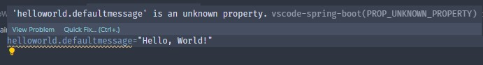

La property che abbiamo appena dichiarato non fa parte di alcuna property dichiarata nei packages che abbiamo importato (ad esempio non è una property di SprinBoot). Per questa ragione ci invita a dichiararne la tipologia ed a fornire una descrizione della property in modo che chi importa il software comprenda i valori al suo interno.

Per fare ciò creeremo un nuovo file chiamato *additional-spring-configuration-metadata.json* all'interno della cartella ./src/main/resources/META-INF

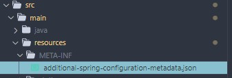

al suo interno descriveremo il dominio di valori accettato per la nuova property ed una descrizione:

[source, json]
----
{
    "properties": [
        {
            "name": "helloworld.defaultmessage",
            "type": "java.lang.String",
            "description": "Messaggio di default in caso di assenza helloDto'"
        }
    ]
}

----

A questo punto possiamo creare il nuovo componente Spring @Configuration. Creeremo dunque un subpackage *configuration* che conterrà i file di configurazione della nostra applicazione.

[source, java]
----
package com.example.demo.configuration;

import org.springframework.boot.context.properties.ConfigurationProperties;
import org.springframework.context.annotation.Configuration;

import java.util.Objects;

@Configuration
@ConfigurationProperties(prefix = "helloworld")
public class HelloWorldConfiguration {
    String defaultMessage;

    public HelloWorldConfiguration() {
    }

    public HelloWorldConfiguration(String defaultMessage) {
        this.defaultMessage = defaultMessage;
    }

    public String getDefaultMessage() {
        return this.defaultMessage;
    }

    public void setDefaultMessage(String defaultMessage) {
        this.defaultMessage = defaultMessage;
    }

    public HelloWorldConfiguration defaultMessage(String defaultMessage) {
        setDefaultMessage(defaultMessage);
        return this;
    }

    @Override
    public boolean equals(Object o) {
        if (o == this)
            return true;
        if (!(o instanceof HelloWorldConfiguration)) {
            return false;
        }
        HelloWorldConfiguration helloWorldConfiguration = (HelloWorldConfiguration) o;
        return Objects.equals(defaultMessage, helloWorldConfiguration.defaultMessage);
    }

    @Override
    public int hashCode() {
        return Objects.hashCode(defaultMessage);
    }

    @Override
    public String toString() {
        return "{" +
                " defaultMessage='" + getDefaultMessage() + "'" +
                "}";
    }

}

----

Oltre al decoratore @Configuration aggiungeremo il decoratore @ConfigurationProperties specificando il prefisso a partire dal quale i campi della classe saranno popolati. Come è possibile notare il nome della variabile è *defaultMessage* è leggermente diverso da quello della property che abbiamo dichiarato *defaultmessage*. Questo disallineamento è voluto in quanto vogliamo dimostrare come Spring, data una classe configuration, consenta allo sviluppatore di scrivere la property in diversi modi. In particolare sarebbe riuscito a leggere qualunque di questi valori:

[source, properties]
----
helloworld.defaultMessage
helloworld.defaultmessage
helloworld.default_message
helloworld.default-message
helloworld.DEFAULT_MESSAGE
----

Come possiamo dunque utilizzare questa @Configuration? Di nuovo, tramite @Autowired !

Modifichiamo dunque la classe HelloWorldService in modo da importare la classe @Configuration e sfruttarla per gli scopi che ci siamo prefissati:

[source, java]
----
package com.example.demo.service;

import org.springframework.beans.factory.annotation.Autowired;
import org.springframework.stereotype.Service;

import com.example.demo.configuration.HelloWorldConfiguration;
import com.example.demo.dto.HelloWorldDTO;

@Service
public class HelloWorldService {
    @Autowired
    HelloWorldConfiguration helloWorldConfiguration;

    public String sayHello(HelloWorldDTO helloDto) {

        if (helloDto == null || helloDto.getNome() == null || "".equals(helloDto.getNome())) {
            return helloWorldConfiguration.getDefaultMessage();
        } else
            return String.format("Hello %s!", helloDto.getNome());
    }
}
----

Per mezzo di @Autowired HelloWorldService sarà in grado di accedere ai campi di HelloWorldConfiguration ed effettuare logica, avete notato che non abbiamo mai invocato il costruttore passando i parametri di application.properties? Questa operazione viene effettuata in automatico dal framework in fase di avvio della nostra applicazione!

Abbiamo modificato il servizio affichè, qualora il DTO fosse nullo, di restituire un messaggio di saluto di default.

Proviamo dunque ad invocare l'API:

[source, shell]
----
curl -X POST http://localhost:8080/hello
{"timestamp":"2022-10-12T07:03:31.517+00:00","status":400,"error":"Bad Request","path":"/hello"}
----

Perchè sta accadendo questo? La ragione potrebbe risiedere nel fatto che stiamo invocando la nostra API senza passare alcun @RequestBody.

In effetti, consultando l'implementazione del decoratore:

[source, java]
----

/**
 * Annotation indicating a method parameter should be bound to the body of the web request.
 * The body of the request is passed through an {@link HttpMessageConverter} to resolve the
 * method argument depending on the content type of the request. Optionally, automatic
 * validation can be applied by annotating the argument with {@code @Valid}.
 *
 * 
Supported for annotated handler methods.
 *
 * @author Arjen Poutsma
 * @since 3.0
 * @see RequestHeader
 * @see ResponseBody
 * @see org.springframework.web.servlet.mvc.method.annotation.RequestMappingHandlerAdapter
 */
@Target(ElementType.PARAMETER)
@Retention(RetentionPolicy.RUNTIME)
@Documented
public @interface RequestBody {

	/**
	 * Whether body content is required.
	 * 
Default is {@code true}, leading to an exception thrown in case
	 * there is no body content. Switch this to {@code false} if you prefer
	 * {@code null} to be passed when the body content is {@code null}.
	 * @since 3.2
	 */
	boolean required() default true;

}
----

Notiamo che lo sviluppatore ci ha lasciato un'indicazione ben precisa riguardo al fatto che, se omesso il campi required, sarà impostato di default a *true*, rendendo obbligatoria la presenza di un request body alla nostra chiamata.

Modifichiamo dunque il controller rendendo il @RequestBody opzionale:

[source, java]
----
@RestController
public class HelloWorldController {
    @Autowired
    HelloWorldService helloWorldService;

    @PostMapping("/hello")
    public @ResponseBody ResponseEntity<String> helloWorld(
            @RequestBody(required = false) HelloWorldDTO helloWorldDTO) {
        return ResponseEntity.ok(helloWorldService.sayHello(helloWorldDTO));
    }
}
----

provando ora ad invocare il servizio:

[source, shell]
----
curl -X POST http://localhost:8080/hello
"Hello, World!"
----

=== Exception Handling

La gestione delle eccezioni è una parte fondamentale dell'implementazione delle logiche di business della nostra applicazione.

In un mondo perfetto potremmo sviluppare il nostro codice dando per scontato che funzioni sempre tutto, dalla nostra logia interna alle interazioni con i clients ed i servizi esterni.

Purtroppo il nostro software, il software con il quale ci integriamo, i frameworks che utilizziamo e le infrastrutture hardware e network che utilizziamo (inclusi i sistemi operativi, gli adattatore di rete ed i drivers) sono possibili oggetti di fallimento per le cause più disparate.

È fondamentale rendere il nostro software robusto a queste anomalie, pensando *sempre* a cosa potrebbe accadere nel caso peggiore ed informare chi ci chiama del fatto che la sua richiesta è andata in errore, invitando a riprovare oppure a modificare la richiesta inviata, qualora questa non fosse aderente a ciò che ci aspettiamo.

Che cos'è una eccezione od https://docs.oracle.com/en/java/javase/17/docs/api/java.base/java/lang/Exception.html[Exception]?

"The class Exception and its subclasses are a form of Throwable that indicates conditions that a reasonable application might want to catch."
-- https://docs.oracle.com/en/java/javase/17/docs/api/java.base/java/lang/Exception.html[Exception javadoc]

In generale, utilizzeremo le eccezioni per segnalare un comportamento inatteso, indesiderato, imprevisto del nostro codice affinché chi invoca il nostro software (il client od anche il software stesso al suo interno) possa gestirlo.

Abbiamo già avuto modo di vedere che Spring, in alcuni casi particolari di errore, già risponde al client con un certo oggetto di risposta, quest'oggetto si chiama https://docs.spring.io/spring-framework/docs/current/javadoc-api/org/springframework/web/server/ResponseStatusException.html[ResponseStatusException]

In caso di necessità possiamo effettuare il throw di una nuova eccezione di questo tipo all'interno del nostro codice, ad esempio: 

[source, java]
----
@PostMapping("/testexception")
public @ResponseBody ResponseEntity<String> testException() {
    throw new ResponseStatusException(
            HttpStatus.NOT_FOUND, "NOT_FOUND", null);
}
----
ci restituirà in caso di invocazione:
[source, shell]
----
curl -X POST localhost:8080/testexception
{"timestamp":"2022-10-12T13:30:23.304+00:00","status":404,"error":"Not Found","path":"/testexception"}
----

Per utilizzi semplici è un ottimo strumento, tuttavia spesso abbiamo la necessità di comunicare messaggi di errore più parlanti dei semplici ritorni del protocollo HTTP, pensiamo ad esempio ad un errore restituito da un webserver dopo la validazione di un determinato @ResponseBody, magari vogliamo rispondere al chiamante che uno o più campi non sono validi e quindi di riprovare.

Come possiamo fare dunque?

Una buona idea sarebbe creare una nostra classe di Eccezione che abbiamo un codice di errore ed un messaggio di errore applicativi, magari censiti staticamente come dei Java enums:.

Creiamo dunque un subpackage *exception* ed all'interno creiamo la nostra Eccezione di risposta alle API chiamata *ApiException*:

[source, java]
----
package com.example.demo.exception;

import java.util.Objects;

import org.springframework.http.HttpStatus;
import org.springframework.lang.Nullable;
import org.springframework.web.server.ResponseStatusException;

public class ApiException extends ResponseStatusException {

    private ErrorCode errorcode;

    /**
	 * Constructor with a response status.
	 * @param status the HTTP status (required)
	 */
	public ApiException(HttpStatus status) {
		super(status, null);
	}

    /**
	 * Constructor with a response status.
	 * @param status the HTTP status (required)
     * @param error the errorCode
	 */
	public ApiException(HttpStatus status, ErrorCode errorcode) {
		super(status, null);
        this.errorcode = errorcode;
	}

    public ErrorCode getErrorcode() {
        return this.errorcode;
    }

    public void setErrorcode(ErrorCode errorcode) {
        this.errorcode = errorcode;
    }

    @Override
    public boolean equals(Object o) {
        if (o == this)
            return true;
        if (!(o instanceof ApiException)) {
            return false;
        }
        ApiException apiException = (ApiException) o;
        return Objects.equals(errorcode, apiException.errorcode);
    }

    @Override
    public int hashCode() {
        return Objects.hashCode(errorcode);
    }
    
}

----

Definiamo inoltre nel medesimo subpackage *ErrorCode*, enum contenente tutti i nostri errore applicativi:

[source, java]
----
package com.example.demo.exception;

/**
 * StatusCode allowed types
 */
public enum ErrorCode {

    HTTP_400("NOT_FOUND");

    private String description;

    ErrorCode(String description) {
        this.description = description;
    }

    public String getDescription() {
        return description;
    }
}
----

Creiamo un handler di prova per testare la nostra nuova eccezione:

[source, java]
----
@PostMapping("/customexception")
public @ResponseBody ResponseEntity<String> customException() {
    throw new ApiException(HttpStatus.BAD_REQUEST, ErrorCode.APP_ERROR);
}
----

Infine testiamo la nostra API:

[source, shell]
----
curl -X POST localhost:8080/customexception
{"timestamp":"2022-10-12T14:19:40.320+00:00","status":400,"error":"Bad Request","path":"/customexception"}
----

Com'è possibile notare l'eccezione è stata lanciata, ma non notiamo alcuna differenza rispoetto all'eccezione lanciata costruendo un oggetto ResponseStatusException.

Questo perchè Spring ha internamente un oggetto chiamato Exception Handler che intercetta quella specifica eccezione (e non le sue derivazioni od estensioni) e quindi ignora i campi aggiuntivi che potrebbero essere stati aggiunti.

Al fine di risolvere questo problema dovremo creare noi il nostro exception handler in modo che gestisca la risposta nel modo in cui ci aspettiamo!

Spring fornisce una classe particolare chiamata https://docs.spring.io/spring-framework/docs/current/javadoc-api/org/springframework/web/servlet/mvc/method/annotation/ResponseEntityExceptionHandler.html[@ResponseEntityExceptionHandler]. Da documentazione ufficiale leggiamo:

"A convenient base class for @ControllerAdvice classes that wish to provide centralized exception handling across all @RequestMapping methods through @ExceptionHandler methods."
-- https://docs.spring.io/spring-framework/docs/current/javadoc-api/org/springframework/web/servlet/mvc/method/annotation/ResponseEntityExceptionHandler.html[Spring javadoc]

Attraverso questa classe possiamo quindi centralizzare la gestione delle eccezioni e, tramite una gestione opportuna di decoratori, possiamo costruire la nostra risposta di errore, qualunque essa sia.

Immaginiamo una risposta generica d'errore che possa comunicarci non solo lo stato HTTP, ma anche qualche codice di errore applicativo, qualcosa di questo tipo:

[source, json]
----
{
	"http_code": 404,
	"http_message": "NOT_FOUND",
	"error_code": "EMP_404",
	"error_message": "Impossibile trovare alcun impiegato con la matricola desiderata"
}
----

Teniamo a mente che è possibile reagire agli errori in diversi modi, in questo modo la risposta viene ricevuta dal chiamante come corpo di risposta HTTP, chi riceve questo emssagio è quindi in grado di interpretarlo e di gestirlo in maniera opportuna. Per esempio un client javascript in esecuzione sul browser può mostrare un popup, una notifica ed una modale. Stessa cosa per un client mobile.

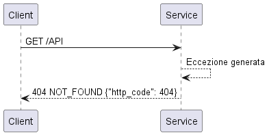

Talvolta le richieste non vengono inviate da una applicazione custom come può essere appunto un client javascript in esecuzione dal browser ma potrebbe arrivare una richiesta direttamente ricevuta dal browser e quindi la risposta non potrebbe essere ricevuta da un client applicativo.

In questi casi tipicamente si può rispondere non tramite corpo di risposta HTTP ma rispondendo con una redirect.

Immaginiamo ad esempio che una nostra API venga invocata dunque a valle di una redirect effettuata da un servizio esterno.

In un browser, quando viene ricevuta una redirect (ad esempio una response HTTP con status code 302 ed header location impostato), il controllo non è più dell'applicazione stessa (ad esempio una single page application) ma il timone passa al browser. In questo caso la nostra applicazione deve conoscere una pagina di atterraggio dove poter propagare lo stato della richiesta che ha ricevuto

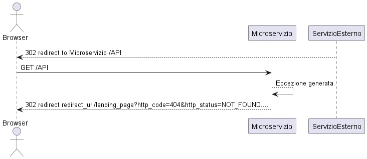

Le informazioni che propaghiamo sono le stesse, sta cambiando solo *il mezzo di propagazione*.
Nel primo esempio stiamo rispondendo con una *response body* http, nel secondo come url request parameters.

Definiamo innanzitutto la nostra risposta di errore, modificheremo la classe ApiException come segue:

[source, java]
----
package com.example.demo.exception;

import java.util.Objects;

import org.springframework.http.HttpStatus;

abstract class ApiException extends RuntimeException {

    private HttpStatus status;
    private ErrorCode errorcode;

    public ApiException(HttpStatus status, ErrorCode errorcode) {
        this.status = status;
        this.errorcode = errorcode;
    }

    public ApiException() {
    }

    public HttpStatus getStatus() {
        return this.status;
    }

    public void setStatus(HttpStatus status) {
        this.status = status;
    }

    public ErrorCode getErrorcode() {
        return this.errorcode;
    }

    public void setErrorcode(ErrorCode errorcode) {
        this.errorcode = errorcode;
    }

    @Override
    public boolean equals(Object o) {
        if (o == this)
            return true;
        if (!(o instanceof ApiException)) {
            return false;
        }
        ApiException apiException = (ApiException) o;
        return Objects.equals(status, apiException.status) && Objects.equals(errorcode, apiException.errorcode);
    }

    @Override
    public int hashCode() {
        return Objects.hash(status, errorcode);
    }

    @Override
    public String toString() {
        return "{" +
                " status='" + getStatus() + "'" +
                ", errorcode='" + getErrorcode() + "'" +
                "}";
    }

}

----

l'abbiamo definita abstract perchè vogliamo in realtà estendere questa strutture per le reali eccezioni che la nostra applicazione dovrà gestire. Inoltre la classe ErrorCode e la sua struttura è stata definita in precedenza, non ha bisogno di alterazioni in quanto la sua implementazione già trasporta le informazioni che ci servono.

A questo punto implementiamo la nostra classe *ApplicationExceptionHandler* nel subpackage *exception*:

[source, java]
----
package com.example.demo.exception;

import org.springframework.http.ResponseEntity;
import org.springframework.web.bind.annotation.ControllerAdvice;
import org.springframework.web.bind.annotation.ExceptionHandler;
import org.springframework.web.context.request.WebRequest;
import org.springframework.web.servlet.mvc.method.annotation.ResponseEntityExceptionHandler;

@ControllerAdvice
public class ApplicationExceptionHandler
    extends ResponseEntityExceptionHandler {

  @ExceptionHandler(value = { ApiException.class })
  protected ResponseEntity<ApiException> handleAPIException(
      RuntimeException ex, WebRequest request) {
    ApiException exception = (ApiException) ex;
    return ResponseEntity.status(exception.getStatus()).body(exception);
  }
}

----

Il @ControllerAdvice dichiara una classe il cui comportamento è simile a quello di una classe controller classica. Contrariamente a quando fino fino ad ora non reagisce a determinate richieste HTTP ricevite dal webserver embedded Tomcat, bensì si mette in _ascolto_ di determinate eccezioni e provvede alla loro gestione tramite un handler definito come metodo java.

Il nostro handler riceve in ingresso una RuntimeException (superclasse di ApiException) ed un oggetto WebRequest, ossia un wrapper della richiesta web ricevuta inizialmente.

La risposta viene confezionata all'interno di una ResponseEntity, ed utilizzeremo le informazioni contenute all'interno della nostra classe ApiException per costruirla, ossia passando a ResponseEntity.status l'HttpStatus contenuti nell'eccezione e come corpo della risposta l'eccezione stessa.

Il nostro lavoro non è ancora finito! ApiException è una classe astratta è pertanto deve essere definita in maniera opportuna da una classe più specifica, definiamo dunque una classe
*NotFoundException* per adempiere a questo scopo:

[source, java]
----
package com.example.demo.exception;

import org.springframework.http.HttpStatus;

public class NotFoundException extends ApiException{

    public NotFoundException(ErrorCode e){
        super(HttpStatus.NOT_FOUND, e);
    }
    
}
----

Una classe molto concisa, ma serve al nostro scopo, in questo caso l'unico argomento del costruttore sarà proprio l'ErrorCode, lo stato HTTP è dunque impostato staticamente in quanto rappresentante il dominio stesso della nostra classe NotFoundException.

proviamo dunque a creare una nostra API su un controller di prova che effettui il throw di un'eccezione di questo tipo.
----
curl http://localhost:8080/testexception
----
[source, json]
----
{
    "cause": null,
    "stackTrace": [
        {
            "classLoaderName": "app",
            "moduleName": null,
            "moduleVersion": null,
            "methodName": "testExceptionHandler",
            "fileName": "HelloWorldController.java",
            "lineNumber": 29,
            "nativeMethod": false,
            "className": "com.example.demo.controller.HelloWorldController"
        },
        {
            "classLoaderName": null,
            "moduleName": "java.base",
            "moduleVersion": "17.0.4",
            "methodName": "invoke0",
            "fileName": "NativeMethodAccessorImpl.java",
            "lineNumber": -2,
            "nativeMethod": true,
            "className": "jdk.internal.reflect.NativeMethodAccessorImpl"
        },
        {
            "classLoaderName": null,
            "moduleName": "java.base",
            "moduleVersion": "17.0.4",
            "methodName": "invoke",
            "fileName": "NativeMethodAccessorImpl.java",
            "lineNumber": 77,
            "nativeMethod": false,
            "className": "jdk.internal.reflect.NativeMethodAccessorImpl"
        },
        {
            "classLoaderName": null,
            "moduleName": "java.base",
            "moduleVersion": "17.0.4",
            "methodName": "invoke",
            "fileName": "DelegatingMethodAccessorImpl.java",
            "lineNumber": 43,
            "nativeMethod": false,
            "className": "jdk.internal.reflect.DelegatingMethodAccessorImpl"
        },
        {
            "classLoaderName": null,
            "moduleName": "java.base",
            "moduleVersion": "17.0.4",
            "methodName": "invoke",
            "fileName": "Method.java",
            "lineNumber": 568,
            "nativeMethod": false,
            "className": "java.lang.reflect.Method"
        },
        {
            "classLoaderName": "app",
            "moduleName": null,
            "moduleVersion": null,
            "methodName": "doInvoke",
            "fileName": "InvocableHandlerMethod.java",
            "lineNumber": 205,
            "nativeMethod": false,
            "className": "org.springframework.web.method.support.InvocableHandlerMethod"
        },
        {
            "classLoaderName": "app",
            "moduleName": null,
            "moduleVersion": null,
            "methodName": "invokeForRequest",
            "fileName": "InvocableHandlerMethod.java",
            "lineNumber": 150,
            "nativeMethod": false,
            "className": "org.springframework.web.method.support.InvocableHandlerMethod"
        },
        {
            "classLoaderName": "app",
            "moduleName": null,
            "moduleVersion": null,
            "methodName": "invokeAndHandle",
            "fileName": "ServletInvocableHandlerMethod.java",
            "lineNumber": 117,
            "nativeMethod": false,
            "className": "org.springframework.web.servlet.mvc.method.annotation.ServletInvocableHandlerMethod"
        },
        {
            "classLoaderName": "app",
            "moduleName": null,
            "moduleVersion": null,
            "methodName": "invokeHandlerMethod",
            "fileName": "RequestMappingHandlerAdapter.java",
            "lineNumber": 895,
            "nativeMethod": false,
            "className": "org.springframework.web.servlet.mvc.method.annotation.RequestMappingHandlerAdapter"
        },
        {
            "classLoaderName": "app",
            "moduleName": null,
            "moduleVersion": null,
            "methodName": "handleInternal",
            "fileName": "RequestMappingHandlerAdapter.java",
            "lineNumber": 808,
            "nativeMethod": false,
            "className": "org.springframework.web.servlet.mvc.method.annotation.RequestMappingHandlerAdapter"
        },
        {
            "classLoaderName": "app",
            "moduleName": null,
            "moduleVersion": null,
            "methodName": "handle",
            "fileName": "AbstractHandlerMethodAdapter.java",
            "lineNumber": 87,
            "nativeMethod": false,
            "className": "org.springframework.web.servlet.mvc.method.AbstractHandlerMethodAdapter"
        },
        {
            "classLoaderName": "app",
            "moduleName": null,
            "moduleVersion": null,
            "methodName": "doDispatch",
            "fileName": "DispatcherServlet.java",
            "lineNumber": 1071,
            "nativeMethod": false,
            "className": "org.springframework.web.servlet.DispatcherServlet"
        },
        {
            "classLoaderName": "app",
            "moduleName": null,
            "moduleVersion": null,
            "methodName": "doService",
            "fileName": "DispatcherServlet.java",
            "lineNumber": 964,
            "nativeMethod": false,
            "className": "org.springframework.web.servlet.DispatcherServlet"
        },
        {
            "classLoaderName": "app",
            "moduleName": null,
            "moduleVersion": null,
            "methodName": "processRequest",
            "fileName": "FrameworkServlet.java",
            "lineNumber": 1006,
            "nativeMethod": false,
            "className": "org.springframework.web.servlet.FrameworkServlet"
        },
        {
            "classLoaderName": "app",
            "moduleName": null,
            "moduleVersion": null,
            "methodName": "doGet",
            "fileName": "FrameworkServlet.java",
            "lineNumber": 898,
            "nativeMethod": false,
            "className": "org.springframework.web.servlet.FrameworkServlet"
        },
        {
            "classLoaderName": "app",
            "moduleName": null,
            "moduleVersion": null,
            "methodName": "service",
            "fileName": "HttpServlet.java",
            "lineNumber": 655,
            "nativeMethod": false,
            "className": "javax.servlet.http.HttpServlet"
        },
        {
            "classLoaderName": "app",
            "moduleName": null,
            "moduleVersion": null,
            "methodName": "service",
            "fileName": "FrameworkServlet.java",
            "lineNumber": 883,
            "nativeMethod": false,
            "className": "org.springframework.web.servlet.FrameworkServlet"
        },
        {
            "classLoaderName": "app",
            "moduleName": null,
            "moduleVersion": null,
            "methodName": "service",
            "fileName": "HttpServlet.java",
            "lineNumber": 764,
            "nativeMethod": false,
            "className": "javax.servlet.http.HttpServlet"
        },
        {
            "classLoaderName": "app",
            "moduleName": null,
            "moduleVersion": null,
            "methodName": "internalDoFilter",
            "fileName": "ApplicationFilterChain.java",
            "lineNumber": 227,
            "nativeMethod": false,
            "className": "org.apache.catalina.core.ApplicationFilterChain"
        },
        {
            "classLoaderName": "app",
            "moduleName": null,
            "moduleVersion": null,
            "methodName": "doFilter",
            "fileName": "ApplicationFilterChain.java",
            "lineNumber": 162,
            "nativeMethod": false,
            "className": "org.apache.catalina.core.ApplicationFilterChain"
        },
        {
            "classLoaderName": "app",
            "moduleName": null,
            "moduleVersion": null,
            "methodName": "doFilter",
            "fileName": "WsFilter.java",
            "lineNumber": 53,
            "nativeMethod": false,
            "className": "org.apache.tomcat.websocket.server.WsFilter"
        },
        {
            "classLoaderName": "app",
            "moduleName": null,
            "moduleVersion": null,
            "methodName": "internalDoFilter",
            "fileName": "ApplicationFilterChain.java",
            "lineNumber": 189,
            "nativeMethod": false,
            "className": "org.apache.catalina.core.ApplicationFilterChain"
        },
        {
            "classLoaderName": "app",
            "moduleName": null,
            "moduleVersion": null,
            "methodName": "doFilter",
            "fileName": "ApplicationFilterChain.java",
            "lineNumber": 162,
            "nativeMethod": false,
            "className": "org.apache.catalina.core.ApplicationFilterChain"
        },
        {
            "classLoaderName": "app",
            "moduleName": null,
            "moduleVersion": null,
            "methodName": "doFilterInternal",
            "fileName": "RequestContextFilter.java",
            "lineNumber": 100,
            "nativeMethod": false,
            "className": "org.springframework.web.filter.RequestContextFilter"
        },
        {
            "classLoaderName": "app",
            "moduleName": null,
            "moduleVersion": null,
            "methodName": "doFilter",
            "fileName": "OncePerRequestFilter.java",
            "lineNumber": 117,
            "nativeMethod": false,
            "className": "org.springframework.web.filter.OncePerRequestFilter"
        },
        {
            "classLoaderName": "app",
            "moduleName": null,
            "moduleVersion": null,
            "methodName": "internalDoFilter",
            "fileName": "ApplicationFilterChain.java",
            "lineNumber": 189,
            "nativeMethod": false,
            "className": "org.apache.catalina.core.ApplicationFilterChain"
        },
        {
            "classLoaderName": "app",
            "moduleName": null,
            "moduleVersion": null,
            "methodName": "doFilter",
            "fileName": "ApplicationFilterChain.java",
            "lineNumber": 162,
            "nativeMethod": false,
            "className": "org.apache.catalina.core.ApplicationFilterChain"
        },
        {
            "classLoaderName": "app",
            "moduleName": null,
            "moduleVersion": null,
            "methodName": "doFilterInternal",
            "fileName": "FormContentFilter.java",
            "lineNumber": 93,
            "nativeMethod": false,
            "className": "org.springframework.web.filter.FormContentFilter"
        },
        {
            "classLoaderName": "app",
            "moduleName": null,
            "moduleVersion": null,
            "methodName": "doFilter",
            "fileName": "OncePerRequestFilter.java",
            "lineNumber": 117,
            "nativeMethod": false,
            "className": "org.springframework.web.filter.OncePerRequestFilter"
        },
        {
            "classLoaderName": "app",
            "moduleName": null,
            "moduleVersion": null,
            "methodName": "internalDoFilter",
            "fileName": "ApplicationFilterChain.java",
            "lineNumber": 189,
            "nativeMethod": false,
            "className": "org.apache.catalina.core.ApplicationFilterChain"
        },
        {
            "classLoaderName": "app",
            "moduleName": null,
            "moduleVersion": null,
            "methodName": "doFilter",
            "fileName": "ApplicationFilterChain.java",
            "lineNumber": 162,
            "nativeMethod": false,
            "className": "org.apache.catalina.core.ApplicationFilterChain"
        },
        {
            "classLoaderName": "app",
            "moduleName": null,
            "moduleVersion": null,
            "methodName": "doFilterInternal",
            "fileName": "CharacterEncodingFilter.java",
            "lineNumber": 201,
            "nativeMethod": false,
            "className": "org.springframework.web.filter.CharacterEncodingFilter"
        },
        {
            "classLoaderName": "app",
            "moduleName": null,
            "moduleVersion": null,
            "methodName": "doFilter",
            "fileName": "OncePerRequestFilter.java",
            "lineNumber": 117,
            "nativeMethod": false,
            "className": "org.springframework.web.filter.OncePerRequestFilter"
        },
        {
            "classLoaderName": "app",
            "moduleName": null,
            "moduleVersion": null,
            "methodName": "internalDoFilter",
            "fileName": "ApplicationFilterChain.java",
            "lineNumber": 189,
            "nativeMethod": false,
            "className": "org.apache.catalina.core.ApplicationFilterChain"
        },
        {
            "classLoaderName": "app",
            "moduleName": null,
            "moduleVersion": null,
            "methodName": "doFilter",
            "fileName": "ApplicationFilterChain.java",
            "lineNumber": 162,
            "nativeMethod": false,
            "className": "org.apache.catalina.core.ApplicationFilterChain"
        },
        {
            "classLoaderName": "app",
            "moduleName": null,
            "moduleVersion": null,
            "methodName": "invoke",
            "fileName": "StandardWrapperValve.java",
            "lineNumber": 197,
            "nativeMethod": false,
            "className": "org.apache.catalina.core.StandardWrapperValve"
        },
        {
            "classLoaderName": "app",
            "moduleName": null,
            "moduleVersion": null,
            "methodName": "invoke",
            "fileName": "StandardContextValve.java",
            "lineNumber": 97,
            "nativeMethod": false,
            "className": "org.apache.catalina.core.StandardContextValve"
        },
        {
            "classLoaderName": "app",
            "moduleName": null,
            "moduleVersion": null,
            "methodName": "invoke",
            "fileName": "AuthenticatorBase.java",
            "lineNumber": 541,
            "nativeMethod": false,
            "className": "org.apache.catalina.authenticator.AuthenticatorBase"
        },
        {
            "classLoaderName": "app",
            "moduleName": null,
            "moduleVersion": null,
            "methodName": "invoke",
            "fileName": "StandardHostValve.java",
            "lineNumber": 135,
            "nativeMethod": false,
            "className": "org.apache.catalina.core.StandardHostValve"
        },
        {
            "classLoaderName": "app",
            "moduleName": null,
            "moduleVersion": null,
            "methodName": "invoke",
            "fileName": "ErrorReportValve.java",
            "lineNumber": 92,
            "nativeMethod": false,
            "className": "org.apache.catalina.valves.ErrorReportValve"
        },
        {
            "classLoaderName": "app",
            "moduleName": null,
            "moduleVersion": null,
            "methodName": "invoke",
            "fileName": "StandardEngineValve.java",
            "lineNumber": 78,
            "nativeMethod": false,
            "className": "org.apache.catalina.core.StandardEngineValve"
        },
        {
            "classLoaderName": "app",
            "moduleName": null,
            "moduleVersion": null,
            "methodName": "service",
            "fileName": "CoyoteAdapter.java",
            "lineNumber": 360,
            "nativeMethod": false,
            "className": "org.apache.catalina.connector.CoyoteAdapter"
        },
        {
            "classLoaderName": "app",
            "moduleName": null,
            "moduleVersion": null,
            "methodName": "service",
            "fileName": "Http11Processor.java",
            "lineNumber": 399,
            "nativeMethod": false,
            "className": "org.apache.coyote.http11.Http11Processor"
        },
        {
            "classLoaderName": "app",
            "moduleName": null,
            "moduleVersion": null,
            "methodName": "process",
            "fileName": "AbstractProcessorLight.java",
            "lineNumber": 65,
            "nativeMethod": false,
            "className": "org.apache.coyote.AbstractProcessorLight"
        },
        {
            "classLoaderName": "app",
            "moduleName": null,
            "moduleVersion": null,
            "methodName": "process",
            "fileName": "AbstractProtocol.java",
            "lineNumber": 890,
            "nativeMethod": false,
            "className": "org.apache.coyote.AbstractProtocol$ConnectionHandler"
        },
        {
            "classLoaderName": "app",
            "moduleName": null,
            "moduleVersion": null,
            "methodName": "doRun",
            "fileName": "NioEndpoint.java",
            "lineNumber": 1789,
            "nativeMethod": false,
            "className": "org.apache.tomcat.util.net.NioEndpoint$SocketProcessor"
        },
        {
            "classLoaderName": "app",
            "moduleName": null,
            "moduleVersion": null,
            "methodName": "run",
            "fileName": "SocketProcessorBase.java",
            "lineNumber": 49,
            "nativeMethod": false,
            "className": "org.apache.tomcat.util.net.SocketProcessorBase"
        },
        {
            "classLoaderName": "app",
            "moduleName": null,
            "moduleVersion": null,
            "methodName": "runWorker",
            "fileName": "ThreadPoolExecutor.java",
            "lineNumber": 1191,
            "nativeMethod": false,
            "className": "org.apache.tomcat.util.threads.ThreadPoolExecutor"
        },
        {
            "classLoaderName": "app",
            "moduleName": null,
            "moduleVersion": null,
            "methodName": "run",
            "fileName": "ThreadPoolExecutor.java",
            "lineNumber": 659,
            "nativeMethod": false,
            "className": "org.apache.tomcat.util.threads.ThreadPoolExecutor$Worker"
        },
        {
            "classLoaderName": "app",
            "moduleName": null,
            "moduleVersion": null,
            "methodName": "run",
            "fileName": "TaskThread.java",
            "lineNumber": 61,
            "nativeMethod": false,
            "className": "org.apache.tomcat.util.threads.TaskThread$WrappingRunnable"
        },
        {
            "classLoaderName": null,
            "moduleName": "java.base",
            "moduleVersion": "17.0.4",
            "methodName": "run",
            "fileName": "Thread.java",
            "lineNumber": 833,
            "nativeMethod": false,
            "className": "java.lang.Thread"
        }
    ],
    "status": "NOT_FOUND",
    "errorcode": "APP_ERROR",
    "message": null,
    "suppressed": [],
    "localizedMessage": null
}
----

Uno stack trace completo e molto verboso! Per le nostre esigenze però è un po' troppo, non dimentichiamoci inoltre che il processo di serializzazione è impegnativo per il nostro software, quindi cerchiamo di limitare all'essenziale i dati che devono essere convertiti.

Creiamo quindi una semplice classe *ApiExceptionResponse*:
[source, java]
----
package com.example.demo.exception;

import java.util.Objects;

public class ApiExceptionResponse {
    
    private Integer httpCode;
    private String httpStatus;
    private String erroreCode;
    private String errorMessage;

    public ApiExceptionResponse(ApiException e){
        this.httpCode = e.getStatus().value();
        this.httpStatus = e.getStatus().name();
        this.erroreCode = e.getErrorCode().toString();
        this.errorMessage = e.getErrorCode().getDescription();
    }
    public Integer getHttpCode() {
        return this.httpCode;
    }

    public void setHttpCode(Integer httpCode) {
        this.httpCode = httpCode;
    }

    public String getHttpStatus() {
        return this.httpStatus;
    }

    public void setHttpStatus(String httpStatus) {
        this.httpStatus = httpStatus;
    }

    public String getErroreCode() {
        return this.erroreCode;
    }

    public void setErroreCode(String erroreCode) {
        this.erroreCode = erroreCode;
    }

    public String getErrorMessage() {
        return this.errorMessage;
    }

    public void setErrorMessage(String errorMessage) {
        this.errorMessage = errorMessage;
    }

    @Override
    public boolean equals(Object o) {
        if (o == this)
            return true;
        if (!(o instanceof ApiExceptionResponse)) {
            return false;
        }
        ApiExceptionResponse apiExceptionResponse = (ApiExceptionResponse) o;
        return Objects.equals(httpCode, apiExceptionResponse.httpCode) && Objects.equals(httpStatus, apiExceptionResponse.httpStatus) && Objects.equals(erroreCode, apiExceptionResponse.erroreCode) && Objects.equals(errorMessage, apiExceptionResponse.errorMessage);
    }

    @Override
    public int hashCode() {
        return Objects.hash(httpCode, httpStatus, erroreCode, errorMessage);
    }

    @Override
    public String toString() {
        return "{" +
            " httpCode='" + getHttpCode() + "'" +
            ", httpStatus='" + getHttpStatus() + "'" +
            ", erroreCode='" + getErroreCode() + "'" +
            ", errorMessage='" + getErrorMessage() + "'" +
            "}";
    }

}

----

Abbiamo inserito al suo interno i soli parametri che ci interessa restituire al chiamante. L'unico costruttore disponibile è quello che accetta in ingresso l'ApiException sopra citata, utilizzeremo i suoi campi per costruire la risposta.

A questo punto dobbiamo modificare l'handler della classe ApplicationExceptionHandler affinchè restituisca una *ApiExceptionResponse*

[source, java]
----
package com.example.demo.exception;

import org.springframework.http.ResponseEntity;
import org.springframework.web.bind.annotation.ControllerAdvice;
import org.springframework.web.bind.annotation.ExceptionHandler;
import org.springframework.web.context.request.WebRequest;
import org.springframework.web.servlet.mvc.method.annotation.ResponseEntityExceptionHandler;

@ControllerAdvice
public class ApplicationExceptionHandler
    extends ResponseEntityExceptionHandler {

  @ExceptionHandler(value = { ApiException.class })
  protected ResponseEntity<ApiExceptionResponse> handleAPIConflict(
      RuntimeException ex, WebRequest request) {
    ApiException exception = (ApiException) ex;
    return ResponseEntity
      .status(exception.getStatus())
      .body(
        new ApiExceptionResponse(exception)
      );
  }
}
----

effettuiamo infine un test:

[source, shell]
----
$ curl http://localhost:8080/testexception
{"httpCode":404,"httpStatus":"NOT_FOUND","erroreCode":"APP_ERROR","errorMessage":"CUSTOM_APP_ERROR"}
----

In questo caso abbiamo passato come argomento del costruttore della nostra *NotFoundException* il valore:

[source, java]
----
ErrorCode.APP_ERROR("CUSTOM_APP_ERROR");
----

Non male vero? In questo modo possiamo gestire un insieme arbitrario di errori applicativi ed informare chi invoca i nostri servizi del tipo di anomalia che abbiamo riscontrato.

In precedenza abbiamo parlato di come gli errori possano essere gestiti anche tramite redirect, attraverso il nostro ApplicationExceptionHandler possiamo gestire anche questa casistica!

In questo caso dobbiamo estendere nuovamente la superclasse *RuntimeException* in modo da differenziare il tipo di evento che il nostro ExceptionHandler deve catturare. Creiamo dunque una classe *RedirectException* simile a quella già creata per ApiException.

[source, java]
----
package com.example.demo.exception;

import java.util.Objects;

import org.springframework.http.HttpStatus;

abstract class RedirectException extends RuntimeException {

    private HttpStatus status;
    private ErrorCode errorCode;

    public RedirectException(HttpStatus status, ErrorCode errorCode) {
        this.status = status;
        this.errorCode = errorCode;
    }

    public RedirectException() {
    }

    public HttpStatus getStatus() {
        return this.status;
    }

    public void setStatus(HttpStatus status) {
        this.status = status;
    }

    public ErrorCode getErrorCode() {
        return this.errorCode;
    }

    public void setErrorCode(ErrorCode errorCode) {
        this.errorCode = errorCode;
    }

    @Override
    public boolean equals(Object o) {
        if (o == this)
            return true;
        if (!(o instanceof RedirectException)) {
            return false;
        }
        RedirectException redirectException = (RedirectException) o;
        return Objects.equals(status, redirectException.status) && Objects.equals(errorCode, redirectException.errorCode);
    }

    @Override
    public int hashCode() {
        return Objects.hash(status, errorCode);
    }

    @Override
    public String toString() {
        return "{" +
                " status='" + getStatus() + "'" +
                ", errorCode='" + getErrorCode() + "'" +
                "}";
    }

}
----
Una classe del tutto simile ad ApiException, la utilizzeremo come superclasse di riferimento del nostro Handler, che gestirà tutte le eccezioni che devono essere gestite tramite redirect.

Creiamo una classe specializzata per l'eccezione NotFound dunque, chiamata *NotFoundRedirectException*:

[source, java]
----
package com.example.demo.exception;

import org.springframework.http.HttpStatus;

public class NotFoundRedirectException extends RedirectException{

    public NotFoundRedirectException(ErrorCode e){
        super(HttpStatus.NOT_FOUND, e);
    }
    
}
----
Essendo i parametri passati direttamente attraverso la URL di redirect come parameters non necessitiamo di una classe Response dedicata, procediamo quindi a scrivere l'handler:

[source, java]
----
@ExceptionHandler(value = { RedirectException.class })
  protected RedirectView handlerRedirectException(
      RuntimeException ex, WebRequest request) {
    RedirectException exception = (RedirectException) ex;
    MultiValueMap<String, String> params = new LinkedMultiValueMap<>();

    params.add("http_code", Integer.toString(exception.getStatus().value()));
    params.add("http_status", exception.getStatus().name());
    params.add("error_code", exception.getErrorCode().toString());
    params.add("error_message", exception.getErrorCode().getDescription());

    return new RedirectView(
        UriComponentsBuilder
            .fromHttpUrl("http://localhost:8080/redirect")
            .queryParams(params)
            .build()
            .encode()
            .toString());
  }
----

Un handler anche qui simile al precedente, ma con qualche differenza.
Notiamo innanzitutto che non stiamo utilizzado una ResponseEntity come return ma un oggetto https://docs.spring.io/spring-framework/docs/current/javadoc-api/org/springframework/web/servlet/view/RedirectView.html[RedirectView]. Quest'oggetto è un wrapper compatto che gestisce la redirect dei nostri handler, come unico parametro richiede un oggetto String che rappresenti la nostra URL di destinazione.

Per compilare tale Url utilizzeremo un oggetto UriComponentsBuilder in quanto la sua struttura ci consente in maniera agevola di impostare un numero arbitrario di query_params (opportunamente codificati url_safe) e l'url di destinazione "http://localhost:8080/redirect".

I parametri sono passati attraverso il metodo del builder queryParams e sono rappresentati da una MultiValueMap<String,String>. Non ci resta che popolare questa mappa con tutte le informazioni desiderate ed abbiamo fatto!

proviamo dunque a testare questa eccezione (non dimentichiamoci di invocarle curl in modalità *verbose*):

[source, shell]
----
curl http://localhost:8080/testredirectexception -v
*   Trying 127.0.0.1:8080...
* TCP_NODELAY set
* Connected to localhost (127.0.0.1) port 8080 (#0)
> GET /testredirectexception HTTP/1.1
> Host: localhost:8080
> User-Agent: curl/7.68.0
> Accept: */*
>
* Mark bundle as not supporting multiuse
< HTTP/1.1 302
< Location: http://localhost:8080/redirect?http_code=404&http_status=NOT_FOUND&error_code=APP_ERROR&error_message=CUSTOM_APP_ERROR
< Content-Language: it-IT
< Content-Length: 0
< Date: Sat, 15 Oct 2022 12:47:20 GMT
<
* Connection #0 to host localhost left intact
----

com'è possibile notare il nostro microservizio ci ha risposto con http_code 302 ed un http header *Location* contenente tutti i parametri a cui siamo interessati.

Questo tipo di risposta è tipicamente pensato per software dotati di UserAgents, ossia attori in grado di prendere il timone della navigazione in particolari momenti. Questa prerogativa è comune a tutti i browsers moderni.

Proviamo ad inserire l'url nella barra degli indirizzi:

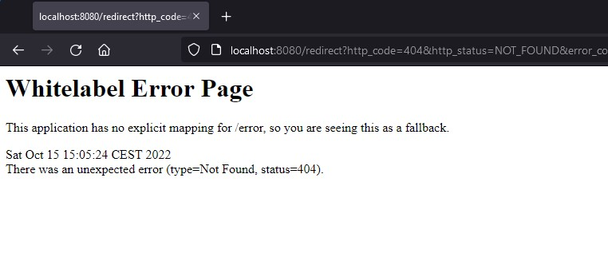

ad un'analisi distratta sembrerebbe che il nostro software non stia funzionando, effettuiamo nuovamente la chiamata utilizzando il code inspector del browser aperto in modalità network:

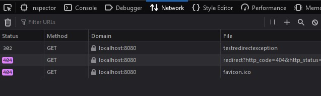

Notiamo che la nostra API di test sta funzionando a dovere, la nostra eccezione dunque è correttamente gestita. Allora cosa vuol dire quella pagina di errore?

Semplicemente è Spring che ci avvisa che è stata richiesta una risorsa /redirect e che questa non è implementata da alcun controller su alcun handler, pertanto interviene rispondendoci 404 NOT_FOUND.

In effetti non abbiamo implementato alcuna API su quell'endpoint. Notiamo che in risposta ad una 302 il browser veicola sempre una GET verso l'indirizzo che è stato posto in risposta all'header Location.

Facciamola dunque, ipotizziamo uno scenario in cui questa API redirect, in caso di errore, restituisca un messaggio di tipo testuale:

"Ops, c'è stato un errore, riprova più tardi"

[source, java]
----
@GetMapping("/redirect")
public @ResponseBody ResponseEntity<String> redirect(
    @RequestParam(name="http_code") String httpCode,
    @RequestParam(name="http_status") String httpStatus,
    @RequestParam(name="error_code") String errorCode,
    @RequestParam(name="error_message") String errorMessage
) {
    if(!httpCode.equals(Integer.toString(HttpStatus.OK.value())))
        return ResponseEntity.ok("Ops, c'è stato un errore, riprova più tardi");
    else
        return ResponseEntity.ok("Tutto ok!");
}
----
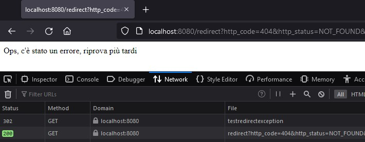

In questo caso non solo stiamo lanciando un'eccezione, ma stiamo anche invocando un servizio in grado di gestirla!

Questo conclude la parte di gestione delle eccezioni. Abbiamo introdotto uno strumento fondamentale che ci tornerà molto utile quando dobbiamo integrarci con altri servizi, e sarà proprio questo l'oggetto del prossimo capitolo.

=== Esercizi

==== 2.1

Spostare tutta la logica di business, strutture dati incluse, in apposita classe @Service chiamata EmployeeService ed integrarla in EmployeeController (con tutte le CRUD operations implementate in precedenza).

[NOTE]
====
Per inizializzare le strutture dati in fase di inizializzazione dei beans è possibile utilizzare https://www.baeldung.com/spring-postconstruct-predestroy[@PostConstruct]
====

==== 2.2

Creare una eccezione Custom chiamata "NotFoundException" che risalga all'utente nel caso in cui si effettui la GET di /employee/{matricola} e l'impiegato con tale matricola non esista.

Risposta attesa:

[source, json]
----
{"timestamp":"2022-10-12T13:30:23.304+00:00","status":404,"error":"Not Found","path":"/employee/{matricola}"}
----

==== 2.3

Creare una eccezione Custom chiamata "ConflictException" che risalga all'utente nel caso in cui si effettui una addEmployee e l'impiegato esiste già.

==== 2.4

Abbiamo la necessità di restituire in risposta, in caso di eccezione, un corpo JSON customizzabile a seconda delle nostre esigenze, il client si aspetta di ricevere in risposta un oggetto JSON del tipo:

[source, json]
----
{
    "httpCode": 404,
    "httpStatus": "NOT_FOUND",
    "erroreCode": "APP_ERROR",
    "errorMessage": "CUSTOM_APP_ERROR"
}
----

In caso di risorsa assente/mancante.

aggiornare la gestione delle eccezioni degli esercizi 2.3 e 2.4 in modo da restituire un messaggio strutturato come richiesto.

==== 2.5

Alcuni flussi sono spesso gestiti non da un client ma da uno UserAgent (es: browser Firefox/Chrome). Progettare una classe di eccezioni che fornisce ad un nuovo endpoint http://localhost:8080/redirect_page i parametri di errore dell'eccezione come delineati nell'esercizio 2.4.

Perchè abbiamo bisogno di questo strumento talvolta? Perchè rispondere con un json body a volta non è possibile? Scrivere la risposta come Javadoc sull'intestazione della nuova classe di eccezioni.

==== 2.6

Spesso per motivi di sicurezza è meglio che alcune eccezioni restituite a frontend/client non forniscano troppe informazioni riguardo l'errore o l'anomalia riscontrata dal backend, tuttavia è comunque necessario fornire un set minimo di informazioni affichè il team di supporto ed application maintenance siano in grado di effettuare un'analisi dell'eccezione.

Creare una nuova classe di eccezioni chiamata "ConfidentialException" che, una volta gestita, restituisca un set ridotto di informazioni al chiamante:

[source, json]
----
{
    "httpCode": 404,
    "httpStatus": "NOT_FOUND",
    "erroreCode": "APP_ERROR"
}
----

deve essere effettuata la medesima astrazione anche per gli use case delineati nell'esercizio precedente.

Aggiornare la gestione delle eccezioni http 404 e 409 degli esercizi precedenti in modo che siano gestite restituendo un set ridotto di informazioni.

== Capitolo 3: Integrazione con servizi esterni

Un buon microservizio, in linea generale, non dovrebbe avere forti dipendenze da servizi esterni. Le architetture a microservizi nascono per garantire ad entità fornitrici di servizi di essere resilienti ai guasti e rispondere sempre alle proprie utenze.

Questa caratteristica molto desiderabile, e che ha reso l'adoption di infrastrutture cloud, containerizzate e distribuite un approccio ormai consolidato per chiunque voglia erogare servizi attraverso un'infrastruttura di calcolo, è detta *High Availability* od *HA*, ossia alta disponibilità.

In italiano spesso ci si riferisce in maniera impropria a questo concetto come *Alta Affidabilità*, tuttavia l'alta affidabilità e l'alta disponibilità sono relative a due diverse grandezze statistiche che sarebbe meglio non confondere.

[quote]
====
La disponibilità rappresenta quanto un sistema sia stato in grado di erogare servizio in codizioni normali al netto dei disservizi, è spesso rappresentata come una percentuale legata ad una specifica finestra temporale
====

data una finestra temporale delimitata dagli istanti iniziali e finali stem:[t_0] e stem:[t_i]
si definisce l'availability come rapporto percentuale:

stem:[0 <= Availability=(TotalServiceTime(t_0, t_i)- sum_(y=1)^n FailTime_y(t_0, t_i))/(TotalServiceTime(t_0, t_i)) <= 1] 

l'affidabilità è una grandezza soggettiva, dipendente dalla mission objective aziendale e tipicamente legata ad una grandezza statistica detta *Mean Time Between Failures*

stem:[MTBF = (TotalServiceTime(t_0, t_i) - MeanTimeToRepair(t_0,t_i))/(NumberOfFailures(t_0,t_i))]

Ossia il tempo di servizio normalizzato per numero di blackout al netto della somma totale dei tempi di interruzione.

Formule matematiche a parte, possiamo rendere ancora più esplicito il distinguo tra le due grandezze.

Ipotizziamo che la nostra azienda gestisca voli aerei di Linea e che abbia moltissimi aerei pronti al volo in hangar, inoltre ha sempre a disposizione personale per poter mettere in esercizio un aereo in hangar in tempi brevissimi.

L'azienda ha osservato che ogni volo di linea, durante l'esercizio, presenta un'avaria con probabilità del 50%.

Se confodessimo alta affidabilità con alta disponibilità sarebbe come dire che la compagnia, pur avendo 1 volo su 2 in avaria, è affidabile perchè ha sempre un aereo di linea pronto a partire in caso di incidente!

Questo preambolo serve a farci comprendere perchè le integrazioni esterne sono un argomento da trattare con le dovute attenzioni ed è per questa ragione che nel capitolo precedente abbiamo introdotto la gestione delle eccezioni.

Rendere un microservizio *dipendente* da un altro significa aver creato un accoppiamento funzionale tra due entità, e quindi il funzionamento di una è condizione necessaria (ma non sufficiente) per il funzionamento dell'altra.

Immaginiamo che il microservizio A sia dipendente per parte del suo funzionamento dal microservizio B, ed il microservizio B sia dipendente per il suo funzionamento dai microservizi C, D, E.

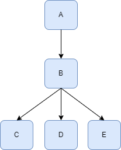

Immaginiamo che il nostro servizio sia il servizio A, questo servizio è soggetto alle medesime condizioni di affidabilità e disponibilità non solo del servizio B, ma anche di C, D ed E.

Non solo, in fase di progettazione di tale microservizio, quando ci viene chiesto di garantire alta affidabilità e disponibilità dello stesso è bene ricordarsi che:

"Possiamo nella migliore delle ipotesi *garantire alta affidabilità ed alta disponibiltà* quanto riesce a garantire la dipendenza con la *peggiore* di queste grandezze."
-- Java Cloud Development Bootstrap

=== REST integration

[TIP]
====
Letture consigliate:

* https://docs.spring.io/spring-framework/docs/current/javadoc-api/org/springframework/web/reactive/function/client/WebClient.html[Webclient Javadoc]
* https://www.baeldung.com/spring-5-webclient[WebClient on Baeldung]
====

Spring possiede un articolato ecosistema di librerie per poterci mettere in comunicazione con altri servizi. A partire da Spring 5 la libreria di riferimento per le comunicazioni HTTP è https://docs.spring.io/spring-framework/docs/current/javadoc-api/org/springframework/web/reactive/function/client/WebClient.html[*WebClient*]

"Non-blocking, reactive client to perform HTTP requests, exposing a fluent, reactive API over underlying HTTP client libraries such as Reactor Netty."
-- Webclient Javadoc

Il primo passo propedeutico al suo utilizzo consiste nell'importare la dipendenza

[source, xml]
----
<dependency>
    <groupId>org.springframework.boot</groupId>
    <artifactId>spring-boot-starter-webflux</artifactId>
</dependency>
----

Successivamente è opportuno scegliere/creare un nuovo package dove sia possibile collocare tutte le integrazioni esterne al nostro servizio, ad esempio: *com.example.demo.client*. Ogni servizio esterno avra un suo package dedicato in modo da isolare le componenti necessarie al suo funzionamento dal resto del software es: *com.example.demo.client.extservicea*

Effettuare una chiamata HTTP con WebClient prevede diverse fasi, principalmente:

1. Costruzione di WebClient
2. Preparazione della richiesta
3. Elaborazione della risposta (con gestione eccezioni)

L'istanza di WebClient che costruiremo è la classe genitrice della nostra integrazione, in particolare le configurazioni come timeouts, header di default, host predefinito e così via verranno ereditate da tutte le altre richieste che genereremo attraverso questa istanza:

[source, java]
----
WebClient client = WebClient.create();
----

per creare un'istanza vuota oppure:

[source, java]
----
WebClient client = WebClient.create("http://localhost:8080");
----

per creare un'istanza che faccia riferimento ad un prefissato host e porta oppure: 

[source, java]
----
WebClient client = WebClient.builder()
  .baseUrl("http://localhost:8080")
  .defaultCookie("cookieKey", "cookieValue")
  .defaultHeader(HttpHeaders.CONTENT_TYPE, MediaType.APPLICATION_JSON_VALUE) 
  .defaultUriVariables(Collections.singletonMap("url", "http://localhost:8080"))
  .build();
----

per customizzare completamente la nostra istanza tramite l'ausilio del Java Builder, di cui consigliamo di consultare la https://docs.spring.io/spring-framework/docs/current/javadoc-api/org/springframework/web/reactive/function/client/WebClient.Builder.html[documentazione java]

Una volta creato il client è necessario definire per una specifica API quale sia il verbo HTTP da usare:

[source, java]
----
UriSpec<RequestBodySpec> uriSpec = client.post();
----

restituendo un oggetto di tipo https://docs.spring.io/spring-framework/docs/current/javadoc-api/org/springframework/web/reactive/function/client/WebClient.UriSpec.html[UriSpec] attraverso cui sarà possibile definire il path di accesso all'API ed il https://docs.spring.io/spring-framework/docs/current/javadoc-api/org/springframework/web/reactive/function/client/WebClient.RequestBodyUriSpec.html[RequestBodySpec]

[source, java]
----
RequestBodySpec bodySpec = uriSpec.uri("/resource");
----

attraverso cui definire il tipo di dato che deve essere spedito nel corpo della richiesta

[source, java]
----
RequestHeadersSpec<?> headersSpec = bodySpec.body(
  Mono.just(new Foo("name")), Foo.class);
----

oppure nel caso di un sett di chiavi-valori

[source, java]
----
LinkedMultiValueMap map = new LinkedMultiValueMap();
map.add("key1", "value1");
map.add("key2", "value2");
RequestHeadersSpec<?> headersSpec = bodySpec.body(
  BodyInserters.fromMultipartData(map));
----

Otterremo infine un oggetto RequestHeadersSpec che ci consentirà di definire il set di HTTP Headers della richiesta (se necessario):

[source, java]
----
ResponseSpec responseSpec = headersSpec.header(
    HttpHeaders.CONTENT_TYPE, MediaType.APPLICATION_JSON_VALUE)
  .accept(MediaType.APPLICATION_JSON, MediaType.APPLICATION_XML)
  .acceptCharset(StandardCharsets.UTF_8)
  .ifNoneMatch("*")
  .ifModifiedSince(ZonedDateTime.now())
  .retrieve();
----

Come abbiamo potuto notare questo tipo di impostazione impone un ordine preciso e rigoroso che ci porta direttamente alla ResponseSpec ossia la risposta del nostro servizio.

Possiamo, similmente a come abbiamo visto nel RequestBodySpec, definire un DTO ad hoc per poter deserializzare la risposta in un oggetto java.

Ricodiamo tuttavia che i servizi esterni con cui ci interfacciamo sono *inaffidabili*, per tanto sarà necessario prevedere un catch per tutti i tipi di eccezione che possiamo riscontrare in fase di chiamata.

Come possiamo dunque scrivere correttamente un client http che si integri con un servizio esterno e che sia ben inserito all'interno di un microservizio Spring?

== Soluzioni

[source, java]
----
package com.example.demo.controller;

import org.springframework.http.ResponseEntity;
import org.springframework.web.bind.annotation.GetMapping;
import org.springframework.web.bind.annotation.RestController;

@RestController
public class HelloWorldController {
    @GetMapping(path="/hello")
    public ResponseEntity<String> helloWorld(){
        return ResponseEntity.ok().body("Hello, World!");
    }
}
----